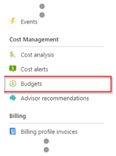
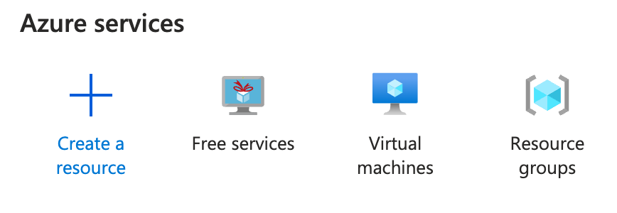

# [Highly_Optional] Azure Cost Managment

**Type**: Individual

**Motivation**: Azure can drain all your credit before you can blink and in suprising ways. Always monitor the budget. It can be found under subscriptions. 

---

## Introduction

Some of you have already received a similar document in the 3rd semester. 

The content here is not strictly necessary if you are only using Azure for Students but it's still good knowledge to carry into your work life.

Scroll down to [Final words](#final-words) for useful tips.

---

## Set limitations on your spendings

It is only possible to set limitations on a Pay-As-You-Go subscription. Azure For Students accounts have a cap of $100 and do not allow users to set up additional alerts. 

---

### Pay-As-You-Go

In case that you have your credit card associated to the account then the following steps are recommended. 

With a pay as you go subscription you should **ALWAYS** set a limit on your spendings.

The way to set limitations on Azure is by creating a `budget`.

1. First, go to your subscription.

2. Then, open "**Budgets**".

3. On your budget page, you will be able to see the different limits you have set.

4. To create a new budget, click "Add".

5. This will bring you to a page where you can specify details about the new budget, as an example, I have set up the following:

6. The budget above sets a limit of kr.- 10 per month.

7. After entering your requested details, click "next" at the bottom of the page

8. On the next page, you must specify "alerts" or warnings given when reaching your limits

9. The example given above will setup the following warnings:
- Warn If 10% of the budget has been used.
- Warn If Azure predicts that 50% or more will be used during the "Reset period".
-   Warn If 80% of the budget has been used.

10. If any of the warnings is triggered, an email will be sent to <your_email>@stud.kea.dk".

11. When everything has been set up, just click "Create" at the bottom of the page.

---

## Final words

As much as possible, use `Azure Free Services`. Search for it and it should appear.

Delete things you don't need. Services that are stopped will still cost money. This includes resource 

Beware that a resource group still consumes credit even if there is no service associated with it. This can be surprisingly costly.

