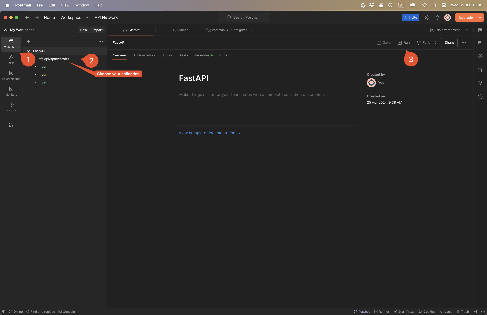
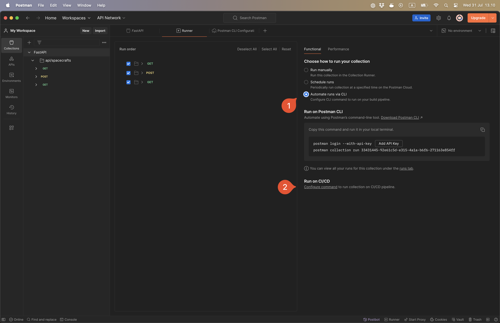

# [Optional] Smoke testing

Add a smoke test to your setup. 

---

## What is smoke testing?

To summarize, a smoke test is a sanity check to check that all parts of the system er operational. 

To help your understanding there are two claims to the origin of the term "smoke test", but they both illustrate well why it is named that:

1. **Hardware testing**: Engineers would turn on components and look for smoke. 

2. **Plumbing**: The practic of sending smoke through pipes to check for leaks.

The Wikipedia article provides great terminology and explanations:

https://en.wikipedia.org/wiki/Smoke_testing_(software)

---

## When to check?

You have 3 choices. Include it as part of:

1. **Continuous Integration**: Run the code on the runner (only possible with cURL and not the Postman tutorial) or a staging server and run the smoke test on it before deploying to production. 

2. **Continuous Deployment**: Run the smoke test on the production server after deployment. This wil still be valuable as a visual indicator on GitHub whether the deployment was successful or not instead of having to go to the website and check if everything is running.

3. **Both CI/CD**: Run the smoke test, then deploy and then do another sanity check to verify. 

Given how simple the pipeline setup is, either of those choices are valid. 

---

## The most basic test (cURL)

The most simple smoke test would be to use cURL. Here is an example workflow. 

```yaml
name: Smoke Test

on:
  workflow_run:
    workflows: "CI"
    types:
      - completed

jobs:
  smoke-test:
    runs-on: ubuntu-latest
    if: ${{ github.event.workflow_run.conclusion == 'success' }}

    steps:
    - name: Run smoke test with cURL
      run: |
        # Replace with the actual URL you want to test
        URL="https://your-app-url.com/"

        # Perform the request and capture the HTTP status code
        HTTP_STATUS=$(curl -o /dev/null -s -w "%{http_code}\n" $URL)

        # Check if the status code is 200
        if [ $HTTP_STATUS -eq 200 ]; then
          echo "Smoke test passed."
        else
          echo "Smoke test failed with status code $HTTP_STATUS"
          exit 1
        fi
```

---

## Create a GitHub Action job with Postman

This is a tutorial on how to create a smoke test with Postman. It is surprisingly easy if you already has a collection (with the production URL) with tests saved to it.

I recommend it as it makes it easier to test for a lot more things than doing it with cURL. 

1. Create or use an existing collection in Postman. The collection should have tests saved to it. It could be to verify a response within a fixed time limit and a status code of `200`.

2. Select the collection and click on `Run`. 



3. Select `Automate runs via CLI`. 

4. Under **Run on CI/CD** click on the underlined link **Configure command**.



5. As the CI/CD provider, select `GitHub Actions` assuming that this is what you are using.


6. Remember to generate your API key. This should be stored as a GitHub Action secret in your repository with the key name: `POSTMAN_API_KEY`.

7. Copy the command and paste it into your GitHub Action workflow.

8. Success! You can now run your Postman tests as part of your pipeline. 

