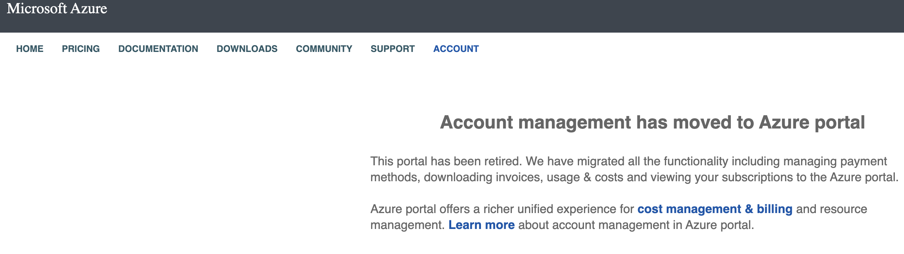
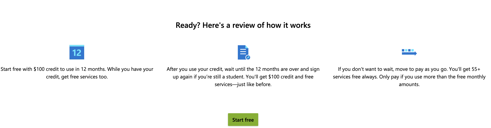
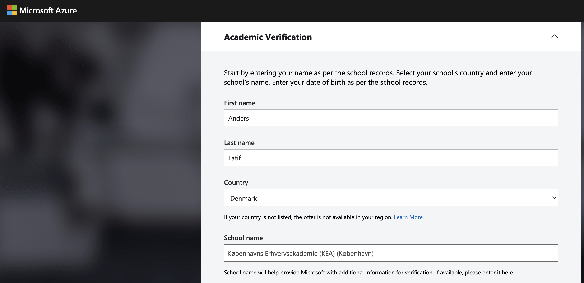
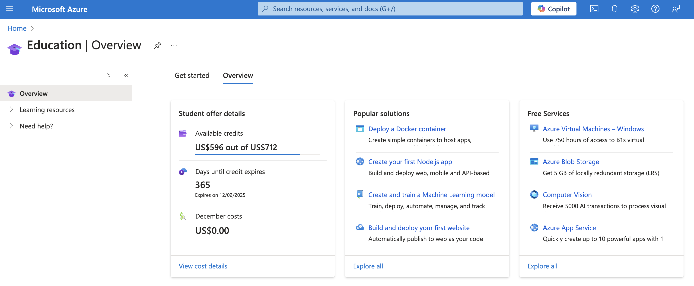

# How to renew Azure for students

---

## Know that your credit is about to expire.

I got the following email:

But the link won't work

---

## Find the page for Azure for students

https://azure.microsoft.com/en-us/free/students/

Scroll down the page and find the "**Start free**" button:

You will be prompted to verify your Academic status (by using your KEA mail):

I am immediately verified and redirected to the following page in the portal and I see the budget going up:

