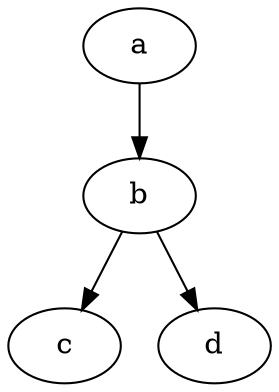

# Create a dependency graph (Digraph) for the legacy system

**Type**: Group work

**Submission**: Save the graph as a SVG or image and store it somewhere where the entire group has quick access to it.

**Motivation**: Helps you understand the dependencies between different parts of the application. Seeing how everything is coupled could help you understand how it could be deocoupled later on for easier maintance and fault tolerance. 

**Part of mandatory I.** 

---

## What is a dependency graph?

A [Dependency Graph](https://en.wikipedia.org/wiki/Dependency_graph) is part of [Graph Theory](https://en.wikipedia.org/wiki/Graph_theory) and consists of [Nodes/Vertices and Edges](https://en.wikipedia.org/wiki/Vertex_(graph_theory)#/media/File:Small_Network.png).

---

## How to create a dependency graph?

There are many great tools for it. Here is an [online Graphviz Tool](https://dreampuf.github.io/GraphvizOnline/).

Try replacing their default example with the snippet below.

Try replace `a` with `Flask`. Remember that it's not just for the `Flask` server and its dependencies but the entire system. 
