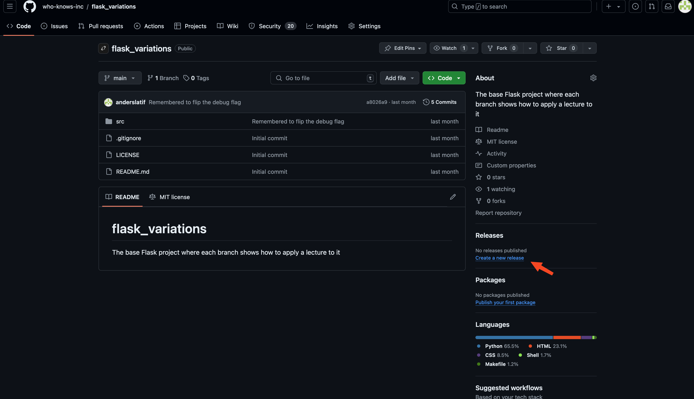
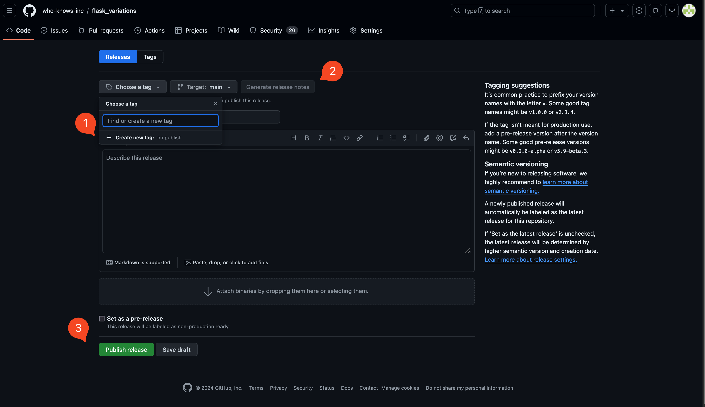

# Git Tagging and Release

Create your first release. 

**Type**: Group work

Feel free to create multiple releases this week. One for checking in the legacy code and one after working on it. 

You are encouraged to create new releases moving forward for every major milestone in your development.


## Create a release on GitHub

It is very easy to create a [release in GitHub](https://docs.github.com/en/repositories/releasing-projects-on-github/managing-releases-in-a-repository). 

1. Click on `Create a new release` on the right side of your repository. This is also where you releases will be accessible.



2. First you must `+ Create new tag`. You are encouraged to use [semantic versioning](https://semver.org/) for tagging. `v.0.1.0` would be a good start.




3. Click on the “Generate release notes”. 

Release notes can be [automatically generated by GitHub](https://docs.github.com/en/repositories/releasing-projects-on-github/automatically-generated-release-notes
). It uses a mixture of PRs, issues, commit messages, tags, contributors and labels. This is why you should always have clear commit messages that explain what has happened.

4. Click on `Publish release` and you are done.


## Tag using git

In the above example the tag is created using GitHub's interface. It's also possible to create a tag using git: 


```bash
$ git add -A
$ git commit -m "Created the first release"
$ git push

$ git tag v0.1.0
$ git push origin v0.1.0
```