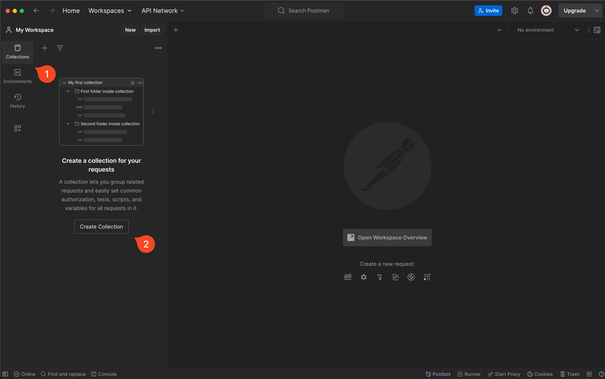
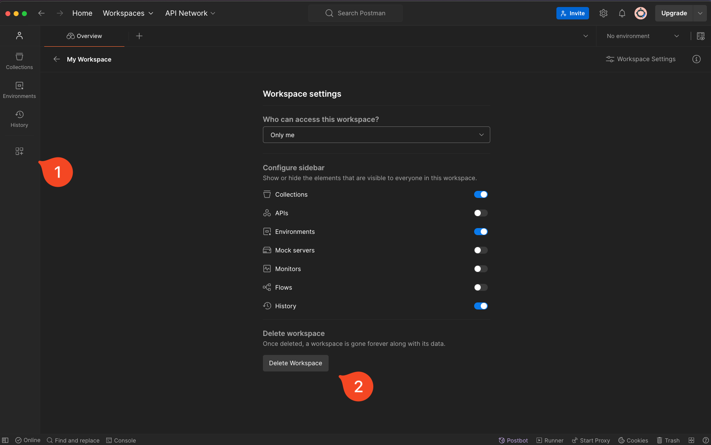
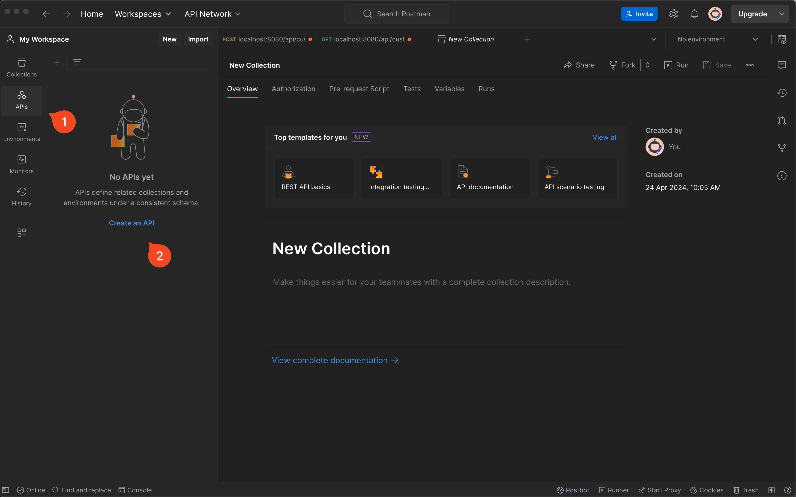
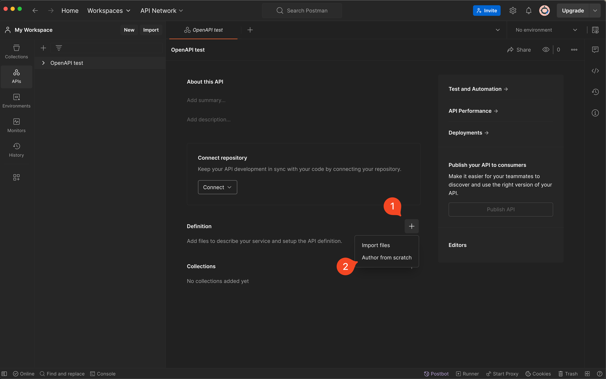

 # [Optional] Generate an OpenAPI spec in Postman

**Type**: Individual

Only if you are interested in seeing how you can use Postman to generate an OpenAPI spec. It is possible to do either based on your collection definition (**Option 2**) but in this example since we have none, we will make Postman generate an example spec for us (**Option 1**).

---

### Create collection

You must create a collection in Postman first. A collection is a group of requests. 

<!-- ---

#### Enable Monitors

Click on the icon below `history` in the left side and enable Monitors. 

 -->

---

# Option 1: Create a new API

Click on the `API` button in the top-left side below `Collections` and in the pane that opens, click on `Create an API`.

---

### Author from scratch

Click the `+` button next to `Definition` and choose `Author from scratch`.

---

### Select `Use a boilerplate`

And OpenAPI version 3.1.

---

### Exercise: Try to understand the YAML file

---

# Option 2: Import OpenAPI spec (Paste)

This was done during class. Check the lecture notes. 
