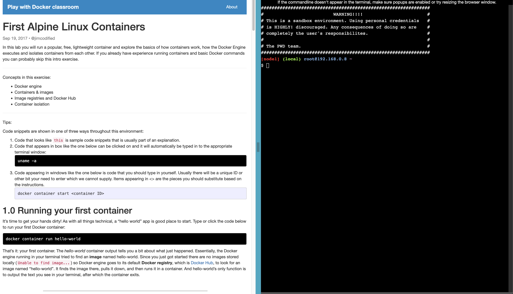

# [Optional] Refresh Docker knowledge

A treasure trove of resources to refresh your Docker knowledge.

**Type**: Individual

---

## Requirements

This task has been marked optional since some of you are confident in your Docker knowledge (based on the self-assessment survey). 

The requirements are that this will help you get more confident in Docker as a concept and working with Docker files. Docker-compose isn't covered until next week.

Some of you had nice introductory hands-on tutorials from last semester. Let me know if you want me to share Erik's with the entire class. 

---

## Docker Introduction

Fast-paced introductory Fireship video introducing Docker concepts:

Another great Fireship video that takes you through everything from the concept, to defining and running containers:

Feel free to code along with the videos.

If you prefer text, this blog post is very concisely written:

https://www.learncloudnative.com/blog/2020-04-29-beginners-guide-to-docker/

---

## The Dockerfile

Overview of all the possible values in Docker:

https://docs.docker.com/reference/dockerfile/

---

## Hands-on practice

[This interactive website](https://training.play-with-docker.com/) explains concepts and provides a terminal to practice in. It can be a bit tricky to find how to get started, from [this page](https://training.play-with-docker.com/dev-stage1/) but the first tutorial can be found by clicking further from this page:

https://training.play-with-docker.com/ops-s1-hello/

You have found it, if you are seeing something that matches this screenshot:

It requires you to sign in with your Docker account. If you don't already have on, here is your chance to create one. 

Docker swarm is not part of the curriculum, but if you are interested in it, you can try out that section as well.

---

## Bonus: Cheat sheets

I have placed some cheat sheets in the repository:

[Docker cheat sheet](./docker_cheatsheet.pdf)

[Docker cheat sheet - PhoenixNAP](./docker-commands-cheat-sheet.pdf)

---

## Bonus: Learn about the different Linux directories

Only if you are interested and have the time:

https://www.youtube.com/watch?v=42iQKuQodW4

---

## Further reading

The official documentation:

https://docs.docker.com/

