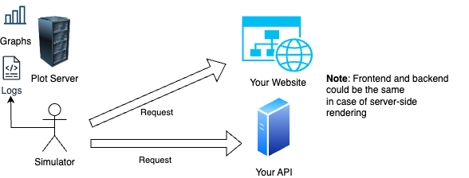

# The simulation

Get ready for the simulation. 

**Type**: Group work

---

## Overview

There are two pieces deployed. The simulator and the plot server.

The **simulator**:

1. Simulates a user interacting with the website.

2. Logs responses and potential errors. 

The **plot server**:

1. Creates a weekly and total plot of how many errors have been logged per group. 

2. Gives you access to the logs for debugging. In principle this should not be necessary as you will suceed as long as you follow the OpenAPI specification. 

---

## The Simulator

The simulator also simulates a growing interest in your product. As the semester progresses, the number of users will increase. But expect this to grow in an organic and realistic way. 

---

## The simulator - Max expected response times

Adhering to a good rule of thumb, the maximum acceptable response times are as following:

| Route        | Maximum Response Time (seconds) |
|--------------|---------------------------------|
| /            | 10                              |
| /search      | 10                              |
| /weather     | 10                              |
| /register    | 10                              |
| /login       | 10                              |
| /api/search  | 6                               |
| /api/weather | 6                               |
| /api/register| 10                              |
| /api/login   | 10                              |
| /api/logout  | 6                               |

If a user experiences higher response times, then they will leave the site.

---

## The plot server

You will find the IP address to the plot server pinned in the `#general` channel in Teams.

Remember not to push the IP address to your repositories. 

Accessing it on port `8000` might give you a view like this:

You can savely ignore the `/logs/date/last`. It is a heartbeat function used to monitor if both the simulator and the plot server are up and running.
