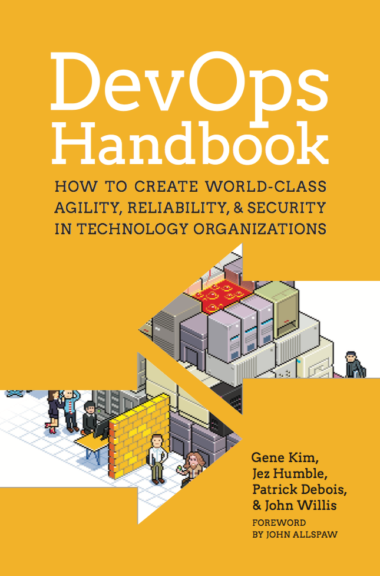

# Read DevOps Literature II

**Type**: Individual

**Deadline**: Before the next week's guest lecture if possible. 

**Motivation**: Reading this ahead of the guest lecture will enhance your experience. Reading it after will still be beneficial. 

---

## What to read

The file is in Teams.

---

## The DevOps Handbook

The first chapter of the DevOps Handbook is full of insightful truths and multiple readings will uncover them. You will get 3 weeks to read this chapter since it is dense and full of information. Make sure to have read it before the guest lecture. I recommend going back on your own throughout the semester. 

Filename: `Chapter 1.pdf`

---

## Reflect

Consider while reading the material, how your group applies these principles.

- Flow
- Feedback
- Continual Learning and Experimentation

Feel free to write them down in order to better remember them. 

<!-- ## The Phoenix Project - Excerpt

This is part of the novel about implementing DevOps at a fictional company where the protagonist "sees the light". 
It's meant to be a light read to show an interesting medium of conveying DevOps principles in. 
You are not expected to understand who the people are but in case you are curious:

Characters: 
- Erik: Mysterious and philosophical IT guru, guiding mentor.
- Chris: Diligent, competent Head of IT Operations.
- John: Overwhelmed, cynical, but skilled IT security manager.
- Steve: Stressed, results-driven, CEO of the company.

Filename: `The Phoenix Project - Excerpt` -->

