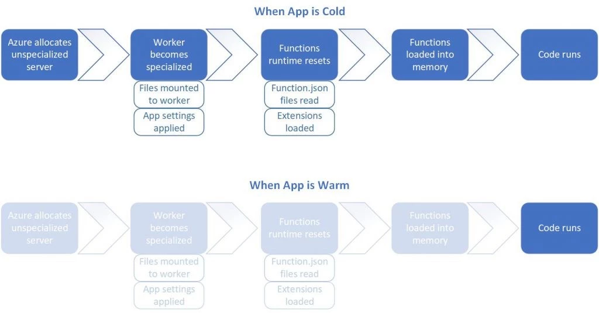

<div class="title-card" style="color: cyan;">
    <h1>Serverless Functions</h1>
</div>

---

# Serverless Functions


---

# Azure Functions - subscription models

* **Consumption plan**: Pay for the time that your code runs. This is **serverless**. 

* **Premium plan**: You specify a number of pre-warmed instances that are always online. 

* **App service plan**: Run as if they are web apps. Not serverless.

---

# Why serverless?

Saves time. Easier to deploy.

Scalable. 

Saves money. (Azure Functions Different pricing plans.)


---

# Azure Functions - Ways to deploy

* In the browser.

* Terminal. 

* IDE (extensions).

* IaC tools. 

---

# Tools for local development

Tools: 

- CLI

- Visual Studio

- VS Code (extension)

- Storage emulators (local)

---

# Cold starts - A problem

Cold start: The time it takes to allocate the function to a server and setup the runtime environment before your code can run.

Functions are held warm for roughly 20 minutes according to below source.





(Source: https://azure.microsoft.com/en-us/blog/understanding-serverless-cold-start/)

---

# More cold start metrics


(Source: https://mikhail.io/serverless/coldstarts/azure/)

---

# Triggers and bindings

https://learn.microsoft.com/en-us/azure/azure-functions/functions-triggers-bindings?tabs=isolated-process%2Cpython-v2&pivots=programming-language-csharp#supported-bindings

---

# Let's create an Azure function in the portal

Must create a Function App. A Function App can contain multiple functions. 

Must associate storage with a Function App.

To call with name key defined in the query string:

Set the authentication level to anonymous either in integration or function.json.

Use the Function key [default] URL. 

---

<div class="title-card" style="color: cyan;">
    <h1>Hands-on Serverless - Azure Functions</h1>
</div>

---

# Create a ressource group

```bash
$ az group create --name <RESOURCE_GROUP_NAME> --location <LOCATION>
```

**RESOURCE_GROUP_NAME**: `class-http-trigger-rg`

**LOCATION**: `westeurope`

**Solution**:

```bash
$ az group create --name class-http-trigger-rg --location westeurope
```

---

# Create a storage account

You must create a storage account to associate with the Function App. This is where the code will be stored. 

```bash
$ az storage account create --name <STORAGE_ACCOUNT_NAME> --location <LOCATION> --resource-group <RESOURCE_GROUP_NAME> --sku Standard_LRS
```

An HTTP trigger means that the function will run when an HTTP request is made to its endpoint.

**Solution**:

```bash
$ az storage account create --name classhttptriggerstorage --location westeurope --resource-group class-http-trigger-rg --sku Standard_LRS
```

---

# Create the function app

```bash
$ az functionapp create --resource-group <RESOURCE_GROUP_NAME> --consumption-plan-location <LOCATION> --runtime node --runtime-version 18 --functions-version 4 --name <FUNCTION_APP_NAME> --storage-account <STORAGE_ACCOUNT_NAME>
```

**Solution**:

```bash
$ az functionapp create --resource-group class-http-trigger-rg --consumption-plan-location westeurope --runtime node --runtime-version 18 --functions-version 4 --name class-http-trigger --storage-account classhttptriggerstorage
```

---

# Create the function

```bash
func init <PROJECT_NAME> --javascript
func new
```

**PROJECT_NAME**: `class-http-trigger`

For `func new`, select `8. HTTP trigger`.

If you don't have func installed you can install it with npm:

```bash
npm install -g azure-functions-core-tools@3 --unsafe-perm true
```

Or: https://learn.microsoft.com/en-us/azure/azure-functions/functions-run-local?tabs=macos%2Cisolated-process%2Cnode-v4%2Cpython-v2%2Chttp-trigger%2Ccontainer-apps&pivots=programming-language-csharp#install-the-azure-functions-core-tools

---

# Deploy the function

```bash
$ func azure functionapp publish <FUNCTION_APP_NAME>
```

**FUNCTION_APP_NAME**: `class-http-trigger`


---

# Try to update the code and redeploy

```bash
$ func azure functionapp publish class-http-trigger
```

---

# Timer triggers

If you generate a Time Trigger function instead of an HTTP Trigger function, you can set the schedule in the generated `function.json` file.

```json
{
  "bindings": [
    {
      "name": "myTimer",
      "type": "timerTrigger",
      "direction": "in",
      "schedule": "0 0 0 * * *"
    }
  ]
}
```

---

# Clean up

```bash
$ az group delete --name class-http-trigger-rg --yes --no-wait
$ az storage account delete --name classhttptriggerstorage --resource-group class-http-trigger-rg --yes
```

**REMEMBER**: Go to the portal and make sure that all the resource groups are deleted.
