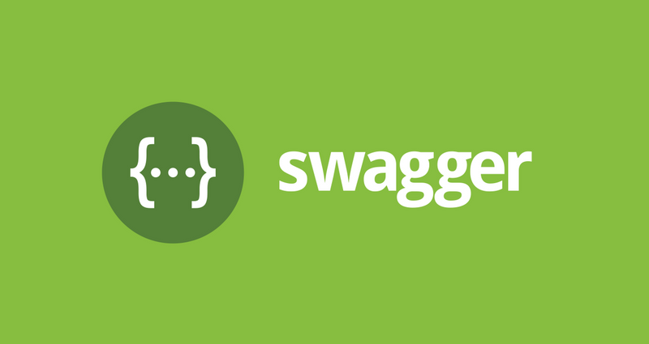
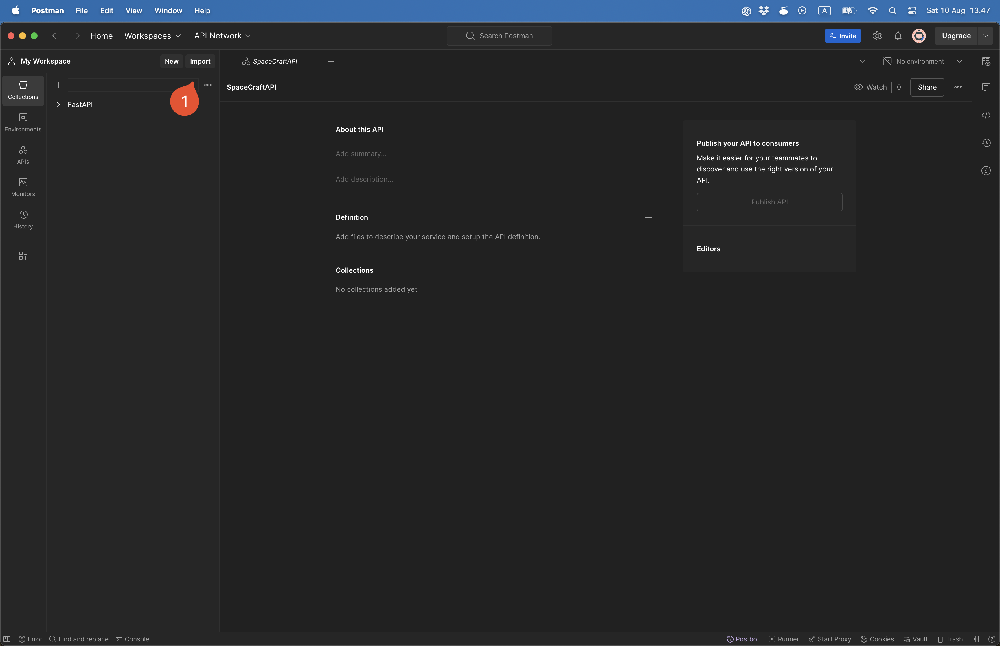
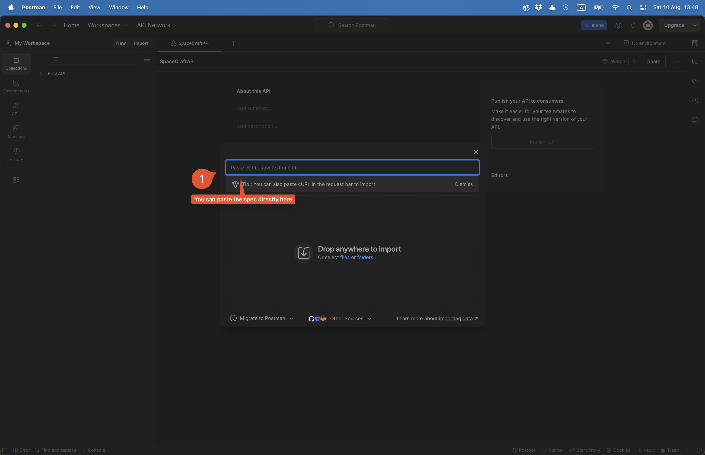
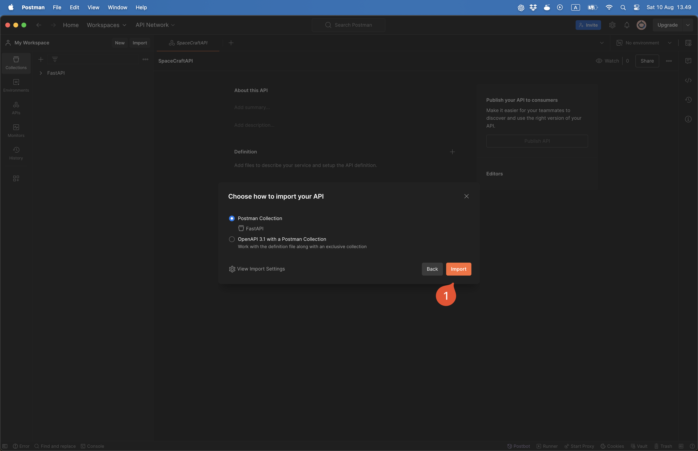

<div class="title-card">
    <h1>OpenAPI</h1>
</div>

---

# What is OpenAPI?

- OpenAPI is a specification for APIs.

- Industry standard for describing REST APIs.

- Is a language-agnostic specification.


---

# History: Swagger

1. Swagger: the company behind OpenAPI. 

2. Swagger: also the previous name of the specification before OpenAPI. 

OpenAPI started at version 3.0. A lot has happened from 3.0 to 3.1.0 (allowing JSON schema): https://www.openapis.org/blog/2021/02/16/migrating-from-openapi-3-0-to-3-1-0



---

# APIs <==> OpenAPI

1. **API => OpenAPI spec**: You can generate OpenAPI documentation from your API.

2. **OpenAPI spec => API**: There are also tools to generate API code from OpenAPI documentation.

3. **Hybrid**: Write API code and OpenAPI spec simultaneously to document it. 


---

<div class="title-card">
    <h1>The whoknows spec</h1>
</div>

---

# We have found a spec for the whoknows API

[OpenAPI specification](https://raw.githubusercontent.com/who-knows-inc/KEA_DAT_DevOps_2024_Autumn/main/00._Course_Material/01._Assignments/02._Conventions_OpenAPI_DotEnv/02._After/openapi.json)

---

# Let's paste it into the online Swagger editor

https://editor.swagger.io/

When it prompts you to convert to YAML, do it.

We see errors in the specification. This does not mean that the specification is faulty. 

---

# Use the newest version of the Swagger Editor

https://editor-next.swagger.io/ 


---

# Time to inspect the documentation. 

*What do you find?*

---

<div class="title-card">
    <h1>How to import it into Postman</h1>
</div>

---

# Select import



---

# Paste the spec



---

# Select import



---

# Alternative ways to see the Swagger UI

You can also run the editor locally with Docker as described here:

https://swagger.io/docs/open-source-tools/swagger-editor/

```bash 
$ docker pull swaggerapi/swagger-editor
$ docker run -p 80:8080 swaggerapi/swagger-editor
```

You can also show it in plain HTML. Great knowledge for Github Pages:

https://github.com/ITAKEA/swagger-docs-test/blob/master/index.html

And of course, the programming language you are using has a library for it. 
