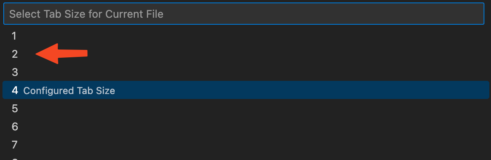
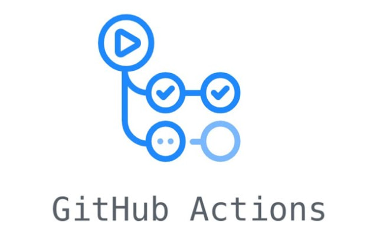

<div class="title-card">
    <h1>GitHub Actions</h1>
</div>

---

# Do you know the difference?

<div style="display: flex; align-items: center;">
    
    
</div>

*Discuss in pairs*

---

# Let's install GitHub CLI (`gh`)

https://cli.github.com/


This is required only once:

```bash
$ gh auth login
```

Then we can run commands like:

```bash
$ gh repo create
$ gh repo delete
$ gh issue create
$ gh pr create
$ gh workflow run
```

...and many more.


---

<div class="title-card">
    <h1>GitHub Actions</h1>
</div>

---

# How to create a workflow

Create any YAML file in the .github/workflows directory.

---

# YAML indentation should be 2 spaces

The problem is that VSCode defaults to 4 spaces (in the workflows folder). Here is how to change it:




---

# GitHub Actions

An Action creates an automation for code in repositories.

Run common tasks in repeatable fashion.



---

# Alternatives offered by other Git platforms


- **BitBucket**: Atlassian Bamboo:


- **Gitlab**: Gitlab CI/CD:


---

# Why use GitHub Actions?

* (+) You are already using GitHub

* (+) It’s free with some limitations (but the alternatives have the same limitation)

https://docs.github.com/en/billing/managing-billing-for-github-actions/about-billing-for-github-actions#included-storage-and-minutes

* (-) The free version is slow


---

# GitHub Actions Marketplace

Contains useful templates for Actions

Community Actions

Create custom actions and upload them to the marketplace


---

# GitHub Actions (terminology) - I

**Event**: Triggers that start a workflow

**Workflows**: Defines an automation from start to finish

**Jobs**: A workflow contains one or more jobs. A job is one or more steps.

**Steps**: Simple commands, shell scripts or actions. Steps can’t run in parallel. Runs in sequence from top to bottom.


---

# GitHub Actions (terminology) - II

**Runner**: Compute layer where jobs are executed. Each job has its own runner.

Runners can run in parallel.

GitHub provides 3 types of runners: Ubuntu, Windows and MacOS.

Using a self-hosted runner is also possible.

GitHub runners comes with pre-installed tools, runtimes and compilers that require minimal configuration.

---

# Single Workflow - Overview I


---

# Overview II


---

# Great Video!

I really recommend this video. 

[](https://youtu.be/-hVG9z0fCac?list=PLArH6NjfKsUhvGHrpag7SuPumMzQRhUKY&t=138)

His others videos in the series are unfortunately not as useful. (I mention this so you can better invest your time).

---

# Overview from the video


---


# Technical requirements:

Workflows must be stored in the `.github/workflows` folder.

Workflows are defined with YAML.

Workflows must define:

* Trigger and branches 
* Permissions
* Job and runner 
* Steps

---


# Workflows from templates

Check out the actions tab in the repository to discover preset workflow templates. 

<div>
    
</div>

---

# Choose an action from the marketplace

In the actions tab choose this workflow:


---

# The checkout action (actions/checkout@v3)

Allows one to clone the repository code to the runner. 

Made by GitHub: https://github.com/actions/checkout

The following can be spicied: 

`@<tag>`, `@<branch>`, `@<commit_sha>`

---

# Let's do it ourselves from scratch!

But this time manually (this is how we will be doing it from now on).

```bash
$ gh repo create

$ mkdir .github

$ cd .github

$ mkdir workflow

$ cd workflows
```

Create hello_world.yaml


---

# Hello World workflow

Let's manually create a workflow that echoes (logs) "Hello World" on every push and PR.

1. Create a new repository. 

2. Create .github/workflows

3. In it, create a file called hello_world.yaml

---

# In hello_world.yaml 


```yaml
name: Hello world workflow

on:
  push:
    branches: [main]
  pull_request:
    branches: [main]

jobs:
  hello:
    runs-on: ubuntu-latest
    steps:
      - uses: actions/checkout@v3
      - name: Run hello world
        run: echo "Hello world"
        shell: bash
```

---

# Let's study the above snippet - Can you spot the uneccessary part?

---

# workflow_dispatch

workflow_dispatch provides a UI button so that a workflow can be triggered in the GitHub UI without the above event triggers.

Under the `on` key add the following: 

```yaml
on: 
    workflow_dispatch:
```

