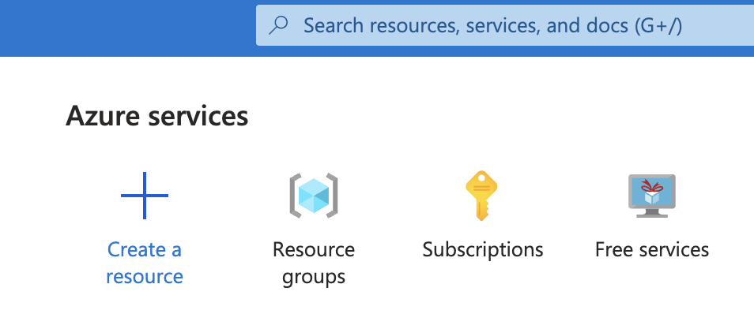
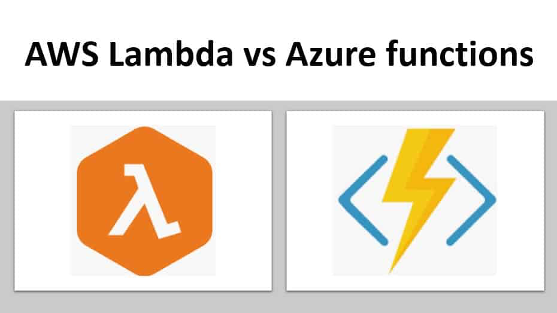
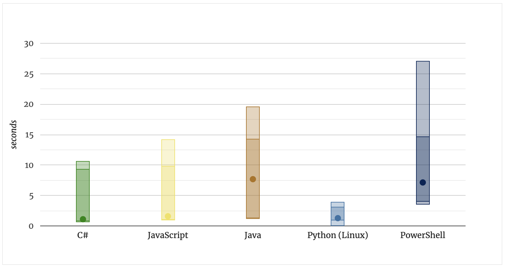

<div class="title-card">
    <h1>Cloud</h1>
</div>


---

# Cloud Providers

<div>
    
</div>


---

# Deployment models

- Public

- Private (on-premise)

- Hybrid

---

# Cloud service model

<div>
    
</div>


Source: imelgrat.me

---

# Cloud Service Model - Part I

- **SaaS (Software as a Service)**
    - Delivers applications over the internet.
    - Users access software from web browsers.
    - Examples: Google Workspace, Salesforce.

- **FaaS (Function as a Service)**
    - Enables running code in response to events.
    - Serverless execution; no need to manage servers.
    - Examples: AWS Lambda, Azure Functions.


---

# Cloud Service Model - Part II

- **DaaS (Desktop as a Service)**
    - Provides virtual desktop environments.
    - Hosted and managed by a third party.
    - Examples: Amazon WorkSpaces, VMware Horizon Cloud, Azure Virtual Desktop.

- **PaaS (Platform as a Service)**
    - Offers hardware and software tools over the internet.
    - Typically used for applications development.
    - Examples: Google App Engine, Heroku, Vercel.

---
    
# Cloud Service Model - Part III

- **STaaS (Storage as a Service)**
    - Provides data storage as a service.
    - Accessible through a network (commonly the internet).
    - Examples: Google Cloud Storage, Dropbox.

- **IaaS (Infrastructure as a Service)**
    - Offers fundamental computing resources.
    - Includes virtual machines, storage, and networks.
    - Examples: Amazon EC2, Microsoft Azure.

---

# From now on the focus is Azure

---

# Azure data centers

<div>
    
</div>


---

# Cost management - Resource Groups I


Please beware that even if no services are running, if a resource group exists it can still use a lot of money. Delete resource groups when not in use. 

Exception: Network Watcher:

https://learn.microsoft.com/en-us/azure/network-watcher/network-watcher-overview

---

# Cost management

Recommendation: When possible use free services. 

<div>
    
</div>

I have provided a guide with the course material on how to setup limitations on Pay-As-You-Go accounts (not Azure for students).

---


<div class="title-card">
    <h1>Virtual Machines</h1>
</div>

---

# Virtual machines 

Virtual machine is the generic term for servers in the cloud.

In AWS they are called **EC2**. In Azure, **Azure Virtual Machines**.

Let's manually create a virtual machine (through Azure Free Services). 

But first, let's generate an SSH key locally which we will use to login.

---

# Generating a SSH-key

Generate a 4096-bit RSA SSH-key pair. 

*nix (tldr ssh-keygen):

```bash
$ ssh-keygen -t rsa -b 4096 -C "comment|email”
```

Windows (2048-bit RSA key is the default): 

```powershell
$ ssh-keygen -m PEM -t rsa -b 4096
```

https://learn.microsoft.com/en-us/azure/virtual-machines/linux/create-ssh-keys-detailed

---

# Let's create a virtual machine

Various OS to choose from. We will use the latest version of Ubuntu.

Allow port 22 so we can ssh into it. 

<div>
    
</div>

---

# SSH into the virtual machine

In case of permission issues:

```bash
$ chmod 600 /path/to/your/file.pem
```

---

# The `apt` package manager

Since we setup an Ubuntu server we can use the default package manager for Debian. 

Ubuntu is a flavor within the broader Debian ecosystem.

If a package exists in the default repository we can run:

```bash
$ sudo apt install <package_name>
```

---

# Upgrade the Ubuntu server

When you provision a new server it's a good idea to upgrade it. Here is how: 

```bash
$ sudo do-release-upgrade
```

Alternative way:

```bash
$ sudo apt update
$ sudo apt full-upgrade
```


---

# Network management: Ports I

There are two type of rules:

1. Inbound: Traffic going **TO** the VM.

2. Outbund: Traffic going **OUT** from the VM. 

Define an inbound rule to whitelist the port that the application is running on so we can access it from the internet.

---
 
# Network management: Ports II


---

# Create a static IP address

https://learn.microsoft.com/en-us/azure/virtual-network/ip-services/virtual-networks-static-private-ip-arm-pportal

---

# Let's tear it down!

Delete it and **REMEMBER** to also delete the resource group!

Repetition: In Azure, a resource group will still cost money, even if there is no service associated with. 

---


<div class="title-card">
    <h1>Other cloud services</h1>
</div>


---

# Cloud storage

AWS: S3 (Simple Storage Service)


Azure: Azure Blob Storage


---

# Azure Blob Storage - I

Use the one under Free Services. 


A Blob Storage can contain multiple contains. Try to upload a file but create a container first. 

Anonymous access level (No other access level is allowed on Azure For Students):

* Private (no anonymous access)

---

# Azure Blob Storage - II

Access not permitted when trying to open the file:


Here are the thing that can be done: 

1. Enable Anonymous Public Read Access 

2. Using Azure AD (Active Directory)

3. Generate a Shared Access Signature (SAS) URL

---

# Shared Access Signature (SAS)

There is a subfolder in this folder titled `generating_sas_token_azureblobstorage` in it you will find a code example in Node.js for how to generate a SAS token. 

Read the README.md to see how. The instructions assume that `az` has been installed. 


---

# AWS S3 policies

Policy Generator: 

https://awspolicygen.s3.amazonaws.com/policygen.html

---

# Serverless computing




---

# Why serverless?

Saves time. Easier to deploy.

Scalable. 

Saves money. (Azure Functions Different pricing plans.)


---

# Azure Functions - subscription models

* **Consumption plan**: Pay for the time that your code runs.

* **Premium plan**: You specify a number of pre-warmed instances that are always online. 

* **App service plan**: Run as if they are web apps. Not serverless.

---

# Cold starts - A problem

Cold start: The time it takes to allocate the function to a server and setup the runtime environment before your code can run.

Functions are held warm for roughly 20 minutes according to below source.


(Source: https://azure.microsoft.com/en-us/blog/understanding-serverless-cold-start/)

---

# More cold start metrics




(Source: https://mikhail.io/serverless/coldstarts/azure/)

---

# Triggers and bindings

https://learn.microsoft.com/en-us/azure/azure-functions/functions-triggers-bindings?tabs=isolated-process%2Cpython-v2&pivots=programming-language-csharp#supported-bindings

---


# Azure Key Vault

A way to store values outside of the code such as environment variables. 

Can be used to authenticate services. 
Also useful for authorization. Access policies can limit usage.

Example use case:
Define the database connection string here. Functions can then get the connection string from the Key Vault. Now it’s removed from the code and can be changed in one place.


