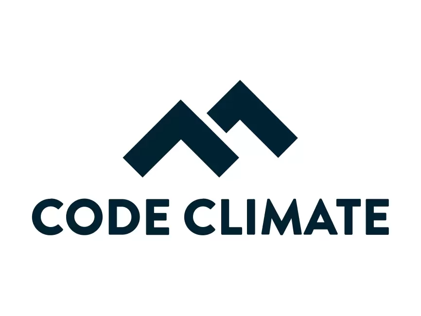

    <h1>Software Quality</h1>

---

# Software quality

Are your systems any good?

How good/bad are they?

What can be done to improve them? 

Our goal is to quantify and answer these questions?

---

# What is software quality? - I

The definition is pretty uniform and standardized. 

> "[...] *the totality of characteristics of an entity that bear on its ability to satisfy stated and implied needs.*

\- [ISO 8402:1994, Quality management and quality assurance – Vocabulary](https://www.iso.org/standard/20115.html)

> *capability of a software product to satisfy stated and implied needs when used under specified conditions*
  
\- [_Systems and software engineering — Systems and software Quality Requirements and Evaluation (SQuaRE) — Guide to
SQuaRE_, International Organization for Standardization, Geneva, CH, Standard, May 2015](https://www.iso.org/obp/ui/#iso:std:64764:en)

---

# What is software quality? - II

More definitions:

> *degree to which a software product satisfies stated and implied needs when used under specified conditions*

\- [_Systems and software engineering — Systems and software Quality Requirements and Evaluation (SQuaRE) — System and software quality models_, International Organization for Standardization, Geneva, CH, Standard, May 2015](https://www.iso.org/obp/ui/#iso:std:iso-iec:25010:ed-1:v1:en)

> *degree to which a software product meets established requirements*

\- [_IEEE 730-2014 IEEE Standard for Software Quality Assurance Processes_](https://standards.ieee.org/standard/730-2014.html)

> *Good software should deliver the required functionality and performance to the user and should be maintainable, dependable, and usable.*

\- [I. Sommerville, _Software Engineering_, 9th ed. USA: Addison-Wesley Publishing Company, 2010.](https://www.pearson.com/us/higher-education/product/Sommerville-Software-Engineering-9th-Edition/9780137035151.html)

---

# Software Quality Models

Since there are many software quality models. Let's have a look at the earliest Boehm's model from 1976 and more recent ones from the ISO 250x0 series of standards.

---

# Boehm 1976 - Quality Model

\- [Boehm et al. _"Quantitative evaluation of software quality"_](https://dl.acm.org/ft_gateway.cfm?id=807736&type=pdf)

---

# Boehm 1976 - Quality Model

\- [Boehm et al. _"Quantitative evaluation of software quality"_](https://dl.acm.org/ft_gateway.cfm?id=807736&type=pdf)

---

# ISO 250x0 - Quality Models

---

# ISO 25010 - Quality in Use Model

---

# ISO 25010 - Product Model

---

# ISO 25023 - Metrics (QMEs)

---

# Why call it "Software Quality" instead of "Code Quality"?

> [...] software is not just the programs themselves but also all associated documentation and configuration data that is required to make these programs operate correctly.

\- Sommerville _"Software Engineering"_ (9th Ed.)

Also check out: 

https://en.wikipedia.org/wiki/Software_quality

---

    <h1>DevOps vs. Software Quality</h1>

---

# DevOps vs. Software Quality

**Value Stream**:

> A value stream is the set of actions that take place to add value to a customer from the initial request through realization of value by the customer.

DevOps is hyperfocused on delivering value to the customer. During development you should ask:

* What is the value of this feature to the customer?

* How can we accellerate when the feature starts generating value?

But this seems at odds with code quality?

---

# The value stream vs. The `ilities`

Industry-wide recommendation is that at least 20% should be reserved for Non-Functional Requirements of the type `ilities` such as:

* maintainability

* manageability

* scalability

* reliability

* testability

* deployability

* security

---

# Bringing value to the customer vs. DX

DevOps does not exclude **D**eveloper E**x**perience. 

There are things that don't directly bring value to the customer, but are valuable to the organization. 

---

# Pull-requests

*Question: What is the value in making PRs?*

---

# Pull-request - Value

  - Ensuring code quality

  - Avoiding the addition of technical debt

  - Knowledge sharing and opportunity for learning and improvement

  - Sharing insight into new features

---

# Practices for Software Quality: Code reviews - I

> At a cost of 1-2% of the project, a 40% decrease in the number of issues was found.

\- R.A. Baker Jr [_"Code reviews enhance software quality"_](https://dl.acm.org/doi/pdf/10.1145/253228.253461)

> Findings  show  that  unreviewed  commits  (i.e., commits  that did  not  undergo  a  review  process)  have  over  two  times  more chances of introducing bugs than reviewed commits (i.e., commits that  underwent  a  review  process).  In  addition,  code  committed after  review  has  a  substantially  higher  readability  with  respect to  unreviewed  code.

\- G. Bavota et al. [_"Four eyes are better than two: On the impact of code reviews on software quality"_](http://citeseerx.ist.psu.edu/viewdoc/download?doi=10.1.1.709.2980&rep=rep1&type=pdf)

---

# Practices for Software Quality: Code reviews - II

> we find that both code review coverage and participation share a significant link with software quality. Low code review coverage and participation are estimated to produce components with up to two and five additional post-release defects respectively. Our results empirically confirm the intuition that poorly reviewed code has a negative impact on software quality [...]

\- S. McIntosh [_"The impact of code review coverage and code review participation on software quality: a case study of the Qt, VTK, and ITK projects"_](https://dl.acm.org/doi/abs/10.1145/2597073.2597076)

---

    <h1>Technical debt</h1>

---

# Technical Debt

A metaphor to financial debt:

> *The longer you wait to pay it off, the more expensive it becomes. Cost of Change (CoC).*

When prototyping, you will make take technical shortcuts in order to move fast. This is not neccessarily bad, but you need to be aware of the debt you accrue. 

---

# Motivations for technical debt

[Source](https://18f.gsa.gov/2015/09/04/what-is-technical-debt/)

---

# [Types of technical debt](https://blog.logrocket.com/product-management/what-is-technical-debt-examples-prioritize-avoid/#types-of-technical-debt)

* **Code debt**: Poorly written code that is hard to understand, maintain, and extend.

* **Design debt**: Poorly designed code that is hard to understand, maintain, and extend.

* **Infrastructure debt**: Outdated infrastructure that is hard to maintain and scale.

* **Testing debt**: Lack of automated tests, or poorly written tests.

* **Documentation debt**: Lack of documentation or poorly written documentation.

* **People debt**: Lack of skilled people or unmotivated people. 

---

# Avoiding technical debt

The [Source](https://www.sonarsource.com/learn/technical-debt/) goes further into how to avoid technical debt.

Great [list on how to avoid technical debt](https://www.digitalocean.com/resources/article/what-is-technical-debt#10-ways-to-manage-and-reduce-technical-debt).

---

# The SQALE method for evaluating technical debt

The model proposes a: 

  - Technical Debt Index (TDI) that is a measure of the amount of technical debt in a software system.

  - Quality Model: SQALE divides quality requirements into multiple layers, such as reliability, maintainability, and efficiency, each containing specific quality rules.

\- [Letouzey _"The SQALE method for evaluating technical debt"_](https://www.researchgate.net/profile/Jean_Louis_Letouzey/publication/239763591_The_SQALE_method_for_evaluating_Technical_Debt/links/0c9605357748774a21000000/The-SQALE-method-for-evaluating-Technical-Debt.pdf)

---

# Concept - Code smells

> a code smell is any characteristic in the source code of a program that possibly indicates a deeper problem.

https://en.wikipedia.org/w/index.php?title=Code_smell&oldid=932717947#Common_code_smells

The blog post that coined the term:

https://martinfowler.com/bliki/CodeSmell.html

---

    <h1>Software Quality tools</h1>

---

# Software Quality tools

**SonarQube**: Provides a maintainability and Technical Debt measure/index

**Code Climate**: Provides a maintainability index

**Beware** that tools will always give an opionated view of quality. Be critical and ask yourself along with your group members:

> *Do we agree with the tool's assessment?*

