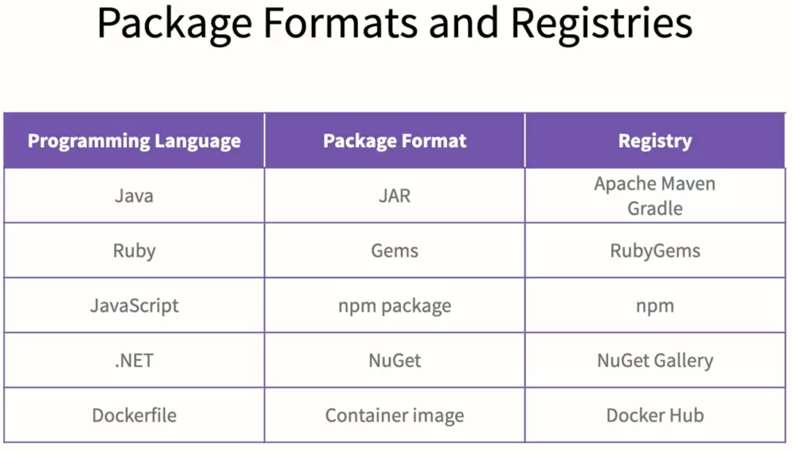

    <h1>Packaging</h1>

---

# Why package?

* **Reusability**: You can reuse your code in other projects.

* **Distribution**: You can distribute your code to others.

* **Versioning**: You can version your code.

* **Dependency management**: You can manage dependencies.

---

# How to distribute code

## As source code

All: `.zip` / `.tar.gz` for instance in GitHub Releases. 

Python: `setup.py` + `requirements.txt`

## As binary code

All: `.exe` / `.dmg` / `.deb` / `.rpm`

Java: `.jar`

C++: `.dll`

## As a container

Docker, Kubernetes, Podman. 

## As a library

Node Modules, Python Packages, Java Libraries.

---

# Examples

---

# Services

* **DockerHub**

* **GitHub**: You can distribute your code on via GitHub Packages.
    
* (+) Integrates nicely with your pipelines in GitHub Actions.

* **JFrog Artifactory**: Supports many types of artifact repositories. 

---

# [Semantic versioning](https://semver.org/)

**Major**: MAJOR version when you make incompatible API changes

**Minor**: MINOR version when you add functionality in a backward compatible manner

**Patch**: PATCH version when you make backward compatible bug fixes

Additional labels for pre-release and build metadata are available as extensions to the `MAJOR.MINOR.PATCH` format.

