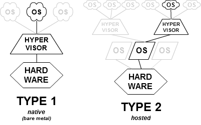
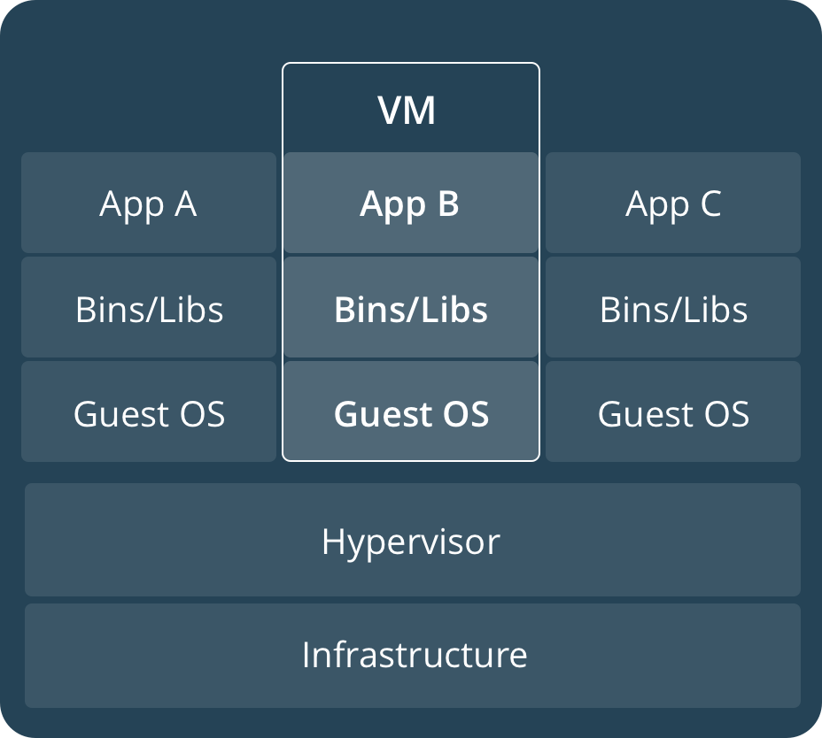

    <h1>Virtualization vs. containerization</h1>

---

# What is virtualization?

*Given a computer, what can you virtualize*?

---

# Virtualization

**Definition**: Virtualization is the process of creating a software-based (or virtual) representation of something rather than a physical one.

**Types**:

1. **Hardware Virtualization**: Virtualization of hardware resources like CPU, memory, and storage.

2. **Software Virtualization**: Virtualization of software resources like operating systems, applications, and networks.

---

# Hypervisor

> A hypervisor or virtual machine monitor (VMM) is *computer software*, *firmware* or *hardware* that creates and runs virtual machines. A computer on which a hypervisor runs one or more virtual machines is called a **host machine**, and each virtual machine is called a **guest machine**.

> This contrasts with **operating-system-level virtualization**, where all instances (usually called containers) must **share a single kernel**, though the guest operating systems can **differ in user space**, such as different Linux distributions with the same kernel.

[Source: Wikipedia - Hypervisor](https://en.wikipedia.org/wiki/Hypervisor)

---

# Containerization

The benefit of containerization is to have multiple applications that share the same kernel. 

Virtual machines require a new OS for each environment. 

| Containers                                                                 | Virtual Machines                                                                |
|----------------------------------------------------------------------------|---------------------------------------------------------------------------------|
|   |  |

[Source](https://web.archive.org/web/20201101123422/https://docs.docker.com/get-started/)

[Source 2](https://www.docker.com/resources/what-container/)

---

# Docker's definition of containers

> A Docker container image is a lightweight, standalone, executable package of software that includes everything needed to run an application: code, runtime, system tools, system libraries and settings.

> Containers isolate software from its environment and ensure that it works uniformly despite differences for instance between development and staging.

[Source: Docker Docs](https://www.docker.com/what-container)

---

# Why containerize?

*Can you think of reasons?*

---

# Benefits of containerization

**Faster Project Setup:** Installing a database + surrounding environment with a single command. 

**Portability:** Containers can run on any machine that has Docker installed.

**Reproducibility:** Consistent setup across systems.
  - Solves the "It Works on My Machine" Problem.

**Isolation:** Separate dependencies for each application. 

**Scailability**: Easier to scale individual services.

---

# History of containers

Containers have been around for decades before Docker. 

**1979 - 1982**: [chroot](https://en.wikipedia.org/wiki/Chroot) command in Unix enables users to create environments for processes. 

**1999**: [FreeBSD jail](https://en.wikipedia.org/wiki/FreeBSD_jail) expands on `chroot` to create isolated environments. Containers are still sometimes called jails. 

**2001 - 2008**: Linux VServer, OpenVZ, cgroups (Google) and LXC.

**2013**: The rise of Docker. Written in Go. 

---

# Modern container runtimes

[containerd](https://containerd.io/)

[Podman](https://podman.io/)

[Kata Containers](https://katacontainers.io/)

Docker

---

# Containerization and DevOps

Containers are not DevOps. But they can help you achieve DevOps. 

According to an early real-world case, Dwayne Holmes experienced how containers increase productivity by **abstracting**:

1. **infrastructure**: the dial-tone principal - you pick up the phone and it works without needing to know how it works

2. **specialization**: operations could create containers that developers could use over and over again

3. **automation**: containers can be built over and over again and everything will just work

Source: Holmes, How a Hotel Company Ran $30B of Revenue in Containers (2020)

