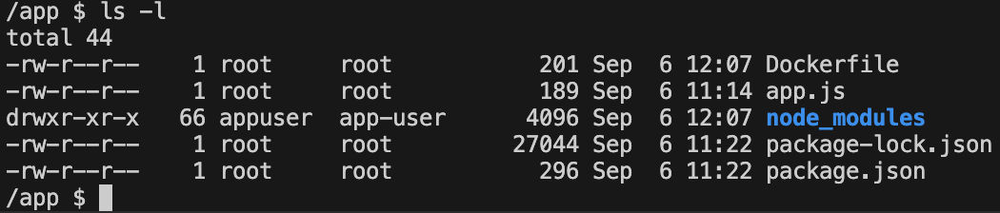
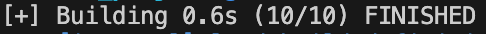

<div class="title-card">
    <h1>The Dockerfile</h1>
</div>

---

# Dockerfile Python example 


```Dockerfile
FROM python:3.9-slim

WORKDIR /app

COPY requirements.txt .

RUN pip install --no-cache-dir -r requirements.txt

# Copy all files from current directory to /usr/src/app in container
COPY . .

CMD ["python", "app.py"]
```

*Can you explain each line?*

---

# Dockerfile Node.js example 

```Dockerfile
FROM node

WORKDIR /usr/src/app

COPY package*.json ./

RUN npm install

COPY . .

EXPOSE 8080
CMD [ "npm", "start" ]
```

*Can you explain each line?*

---

# Two ways to start

*What is the difference between these two?*

```Dockerfile
CMD ["node", "app.js"]
# AND
CMD ["npm", "start"]
```

---

# Running commands in Dockerfile

RUN can be specified multiple times while CMD and ENTRYPOINT can only be specified once.

```Dockerfile
RUN npm install
```

Two possible syntaxes:

```Dockerfile
CMD ["node", "app.js"]
# OR
CMD node app.js
```

ENTRYPOINT example:

```Dockerfile
ENTRYPOINT ["node", "app.js"]
```

---

# RUN vs CMD vs ENTRYPOINT

**RUN**: Executes during the build phase to set up the image. Can be run multiple times.

**ENTRYPOINT**: Defines the main command to run when the container starts. You can pass flags when running the container.

**CMD**: Provides the default command to execute when starting a container. You can override `CMD` when running the container by adding `node another_app.js` after `docker run <image_name>` for example. 

You can combine the last two:

```Dockerfile
ENTRYPOINT ["node"]
CMD ["app.js"]
```

Which gives the freedom to do the following:

```bash
$ docker run --entrypoint node_runtime_latest <image_name>
$ docker run <image_name> another_app.js
```

---

# Docker hands-on meta slide

Since the `whoknows_variations` will show how to create `Dockerfile`s and `docker-compose.yml` files for Python. 

The in-class exercises will focus on Node.js. 

---

# Let's set up a Node.js project

```bash
$ mkdir 02._docker_node_project
$ cd 02._docker_node_project
$ mkdir node_project
$ cd node_project
$ npm init -y
$ npm install express
```

First we will set `type: module` in `package.json` to use ES6 modules.

Then set up the server in `app.js`. 

---

# Create the Dockerfile in `node_project`

```Dockerfile
FROM node

WORKDIR /usr/src/app

COPY package*.json ./

RUN npm install

COPY . .

EXPOSE 8080
CMD [ "node", "app.js" ]
```

---

# Build and run

Let's name the image `node_project`:

```bash
$ docker build -t <image_name> .
```

We want to map both the host port and the container port to `8080`


```bash
docker run -p <host_port>:<container_port> <image-name>
```

*Can you figure it out?*

---

# Build and run solution

Solution: 

```bash
$ docker build -t node_project .
$ docker run -p 8080:8080 node_project
```

Combined:
    
```bash
$ docker build -t node_project . && docker run -p 8080:8080 node_project
```


---

# Dockerfile create a user 

```Dockerfile
FROM node:14.16.0-alpine3.13

RUN addgroup app-user && adduser -S -G app-user appuser

USER appuser

WORKDIR /usr/src/app

COPY package*.json ./

RUN npm install

COPY . .

EXPOSE 8080
CMD [ "node", "app.js" ]
```

---

# Check user

Run it with an interactive shell:

```bash
$ docker build -t node_project .
$ docker run -it --rm node_project /bin/sh
```

See the user:

```bash
/app $ whoami
app-user
```

---

# Check who owns the files


Check who owns the files:

```bash
/app $ ls -l
```



`node_modules` is owned by `app-user` because `npm install` was run as `app-user`.

---

<div class="title-card">
    <h1>.dockerignore</h1>
</div>


---

# .dockerignore


*What are files and folders to ignore?*

---

# `.dockerignore` possible template

```plaintext
**/.git
**/.gitignore
**/.vs
**/.vscode
**/*.*proj.user
**/*.dbmdl
**/*.jfm
**/bin
**/docker-compose*
**/node_modules
**/npm-debug.log
**/obj
**/secrets.dev.yaml
**/values.dev.yaml
```

Let's add it to the project.

---

<div class="title-card">
    <h1>Docker layers</h1>
</div>

---


# Docker layers

Each image consists of a layer. 

When you build an image, Docker creates a new layer for each instruction in the Dockerfile. 

When you change the Dockerfile and rebuild the image, only the layers that have changed are rebuilt.

Inspect the layers with:

```bash
$ docker history <image-name>
```

The bottom part are the layers of the base image.

---

# Docker layers optimization

When building an image, Docker will only execute instructions from top to bottom. But it only executes the instructions that have changed.

Otherwise it will reuse the layers from the cache.

This file is not optimized. *How can we use Docker's caching mechanism more efficiently?*

```Dockerfile
FROM node

WORKDIR /usr/src/app

COPY . .

RUN npm install

EXPOSE 8080

CMD [ "node", "app.js" ]
```

---

# Improved Dockerfile

If there is no change to `package.json` then there is no need to run `npm install` again.  

```Dockerfile
FROM node

WORKDIR /usr/src/app

COPY package*.json ./

RUN npm install

COPY . .

EXPOSE 8080

CMD [ "node", "app.js" ]
```

Note, that this is with only one dependency (Express). With more dependencies the difference could easily amount to a minute vs. less than a second. 




