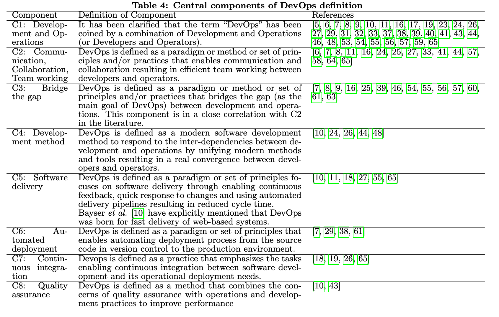
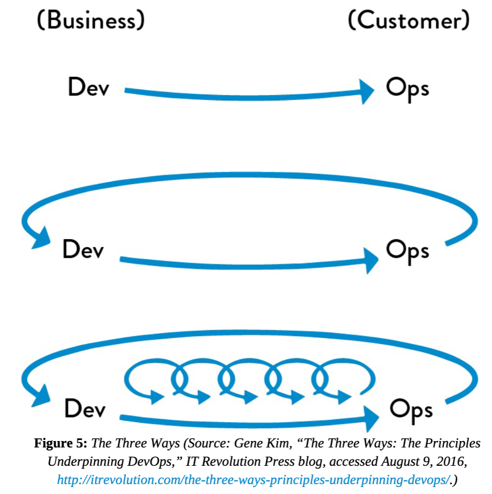

    <h1>DevOps</h1>

---

# What is DevOps?

*Discuss in pairs.*

---

# [What is DevOps? A Systematic Mapping Study on Definitions and Practices](https://www.researchgate.net/publication/308857081_What_is_DevOps_A_Systematic_Mapping_Study_on_Definitions_and_Practices)

**Problem**: There is no common definition of DevOps.

**Solution**:

A research paper that has compared definitions and practices of DevOps in research literature. 

Identify and classify practices associated with DevOps.

Compare DevOps with other development methods.

---

# Research paper - Central definitions

---

# Research paper - DevOps practices

---

# DevOps Handbook

What are some principles you remember from the `DevOps Handbook`?

---

# DevOps Handbook - The Three Ways

Disclaimer: The Three Ways is one way to think about DevOps. It's rooted in Lean principles. 

---

# The Principles of Flow

* Make Work Visible. 

* Limit Work in Progress

* Reduce Batch Sizes

* Reduce the Number of Handoffs

* Continually Identify and Evaluate Constraints

* Eliminate Hardships and Waste in the Value Stream

*How do you achieve these in your group?*

---

#  The Principles of *Feedback*

* See Problems as They Occur

* Swarm and Solve Problems to Build New Knowledge

* Keep Pushing Quality Closer to the Source

* Enable Optimizing for Downstream Work Centers

*How do you achieve these in your group?*

---

#  The Principles of *Continual Learning and Experimentation*

* Institutionalize the Improvement of Daily Work

* Transform Local Discoveries into Global Improvements

* Inject Resilience Patterns into Our Daily Work

* Leaders Reinforce a Learning Culture

*How do you achieve these in your group?*

---

# Free discussion

DevOps shouldn't be a cult. 

First you had to understand it better and now is your chance to think critically about DevOps.