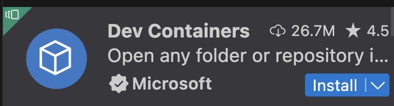
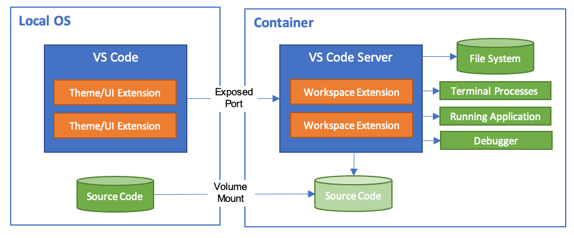
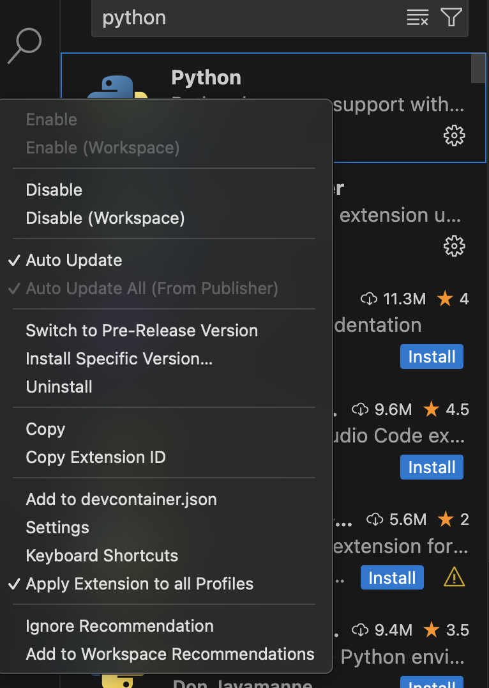

    <h1>Devevelopment Containers</h1>

---

# What are [development containers](https://containers.dev/)?

Dev containers allows you to run your code in a container.

But it can also specify the surrounding environment, like the tools you need to run your code.

For instance, you could specify what IDE extensions should be installed for a specific project without installing them on your local machine.

It can then easily be shared or run in the cloud. 

---

# IDE support

Dev containers were developed for VSCode but support has been added for Visual Studio.

IntelliJ currently has early support for it as of now. You can keep track of updates to the support:

https://containers.dev/supporting

The tutorial will be focusing on VSCode.

---

# Install the Dev Container extension

You can install the extension from the VsCode marketplace. 

Then click **"Open a Remote Window"** in the lower left corner.

Choose Dev Container to install it and Docker Desktop should open if it isn't running.

---

# How dev containers mount

[Source: VSCode documentation](https://code.visualstudio.com/docs/devcontainers/containers)

---

# Gitpod

https://www.gitpod.io/

---

# Create a Dev Container from scratch

Select **"New Dev Container..."** and choose any that fits your needs. We will choose `Basic Python`.

Choose **"Create Dev Container"** and it will create a `.devcontainer` folder with a `Dockerfile` and `devcontainer.json`.

---

# Adding extensions to the container

Search for the extension and right click on it. Then choose *"Add to devcontainer.json"*.

---

# Running the container

In the lower left corner, click on the green button and choose **"Reopen in Container"**.

---

# Good video resources

---

# Problems with dev containers

- **Performance**: Running a container can be slower than running code on your local machine.

- **Persisting Volumes**: Working with a test database and wanting to persist the data can be tricky.

