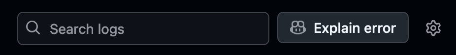
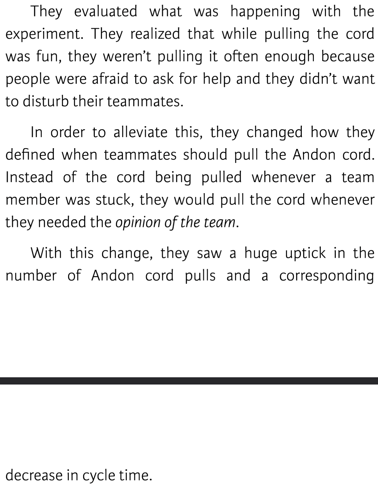

<div class="title-card">
    <h1>Testing, Security</h1>
</div>

---

# gh pr view example

```bash
$ gh pr view
```

---

# New Github Copilot feature

Add Copilot as a reviewer to your PRs and it will suggest code changes that can be accepted with a click.

---

# New Copilot feature integrated in Github Actions

Explain Error:



https://github.com/who-knows-inc/whoknows_variations/actions/runs/10325192454/job/28586272559


---

# Swarming the problem 

Andon Cord is a concept from the Toyota Production System. 

https://en.wikipedia.org/wiki/Andon_(manufacturing)

It appears in DevOps literature. 

https://devops.com/youre-not-devops-cant-pull-cord/

The DevOps Handbook goes into detail of implementing the andon cord at Excella

---

# Definition: Cycle time

*Does this sound familiar?*

> Excella noticed during a team retrospective that their cycle times were beginning to rise. They had what Joshua Cohen described as a case of the “almost dones.” He noted, “During standup, our developers would give an update on the feature they were working on the previous day. They would say, ‘Hey, I made a lot of progress. I’m almost done.’ And the next morning they would say, ‘Hey, I ran into some issues but I worked through them. I just have a few more tests to run. I’m almost done.’”

\- Ayers and Cohen, “Andon Cords in Development Teams.”

> To measure their Andon cord experiment, the team decided to focus on reduction in cycle time as the key metric for success, as well as increasing the team’s collaboration and getting rid of the “almost dones” by talking about issues when they arose.

---

# Andon cord at Excella


---

# Psychological safety



---

# How they implemented it

> Instead of a literal string or cord to pull, the team created a bot in Slack as a metaphorical Andon cord. When someone typed in andon, the bot would @here the team, notifying everyone in Slack. But they didn’t want to end it there. They also created an “if/this/then/that” integration in Slack that would turn on a rotating red light, string lights, and even a dancing “tube” man in the office.

---

# Weekly DevOps pep-talk!

## DevSecOps

*Secure by design, not as an afterthought.*


