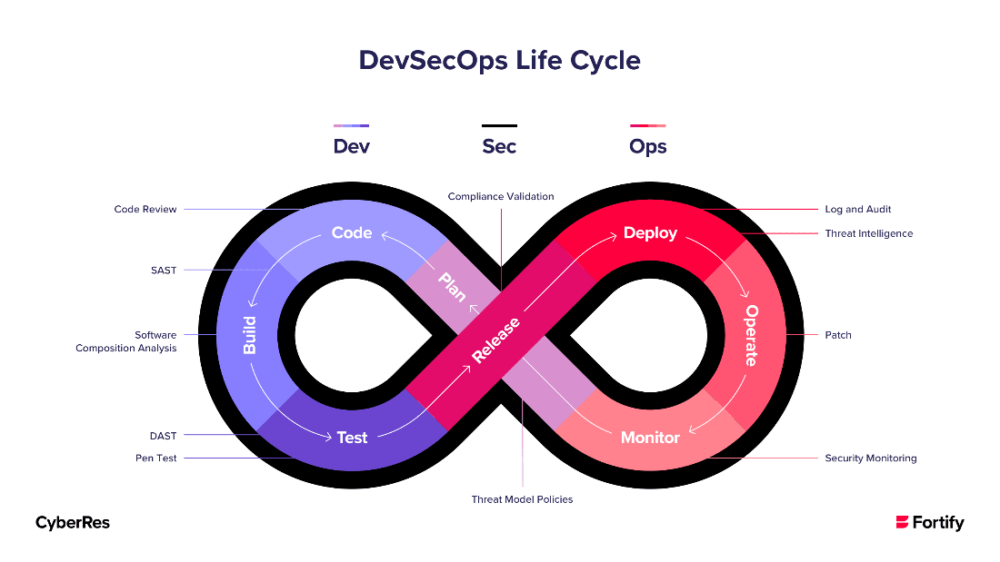

    <h1>DevSecOps</h1>

---

# How is DevSecOps different from DevOps + Security?

Security becomes part of every step of CI/CD.

All developers become responsible of security.

The security team becomes advisors rather than police.

---

# The Phoenix Project

According to **The Unicorn Project**: The security team should work to help the DevOps mission of getting value to the customer faster in a secure way rather then strike paranoia.

---

# The State of Octoverse - Security

The 2020 State of Octoverse report shows that keeping your software current is the best way to secure your codebase. 

https://octoverse.github.com/2020/#securing-software

---

# DevSecOps Figure 8

---

# DevSecOps Figure 8 - Version 2

[Source](https://www.mend.io/blog/sast-static-application-security-testing/)

---

# SAST vs. DAST - And tools

## SAST: Static Application Security Testing

Also called white-box testing.

SonarQube, Checkmarx, Fortify, Veracode, etc.

## DAST: Dynamic Application Security Testing

Also called black-box testing.

OWASP ZAP, Burp Suite, etc.

---

# Security Gates in CI/CD

- Pre-commit (static analysis, dependency scanning)

- Pre-merge (code review)

- Pre-deployment (testing)

- Post-deployment (monitoring)

---

# Tool that delivers security in CI/CD: Jfrog Xray

End-to-end security and compliance for your software supply chain.

https://jfrog.com/xray/

---

# Monitor

In a professional setting where security matters, you should monitor the following:

- traffic

- access

- file changes

etc. 

Dashboard tool: Zabbix.

---

# Red-Team vs Blue-Team

Red team:

- Attackers

Blue team:

- Defenders

---

# Be prepared for a breach

Automate back-ups. 

Data is probably your most precious asset; don't lose it.

*What should you do if there is a breach?*

---

# GDPR

Inform the affected parties (users). Inform the authorities.

In the simulation, I do not expect you to adhere to GDPR if there is a data leak. Please don't contact datatilsynet.

