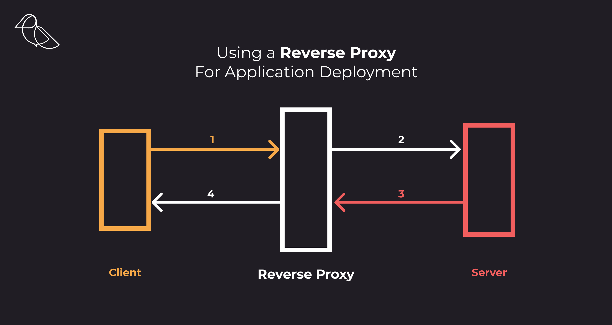

<div class="title-card">
    <h1>Security in cloud</h1>
</div>

---

# Course requirement

You are not expecting to implement advanced cloud security measures such as VPCs, NACLs, and security groups.

These slides serve to inform.

---

# Resource: Learn about Security Groups in Azure

[](https://www.youtube.com/watch?v=w8H5fWBHddA)


---

# VPC / VNET

VPC: Virtual Private Cloud (often associated with AWS)
VNET: Virtual Network (Azure's term)
I will use the generic term VPC in class.

A VPC is an isolated cloud network within a public cloud environment.
Allows cloud services in the same data center to communicate securely without going through the public internet. 
Provides control over IP address ranges, subnets, network gateways, and security settings.

---

# VPC security (NACL)

NACL (Network Access Control Layer):

- NACL

- SG (Security Groups)

- Firewall

---

# Subnets

Private subnets

Public subnets

---

# Gateways

IG (internet gateway)

VPC Peering (connect multiple VPCs)

NAT (allows devices in the VPC to connect to the internet)

---

# Application Layer

NLB (Network Load Balancer)

ALB (Application Load Balancer)

---

# Example of a pro setup


---

<div class="title-card">
    <h1>fail2ban</h1>
</div>

---

# Let's look at the auth logs

On your server, try running this command:

```bash
$ cat /var/log/auth.log
```

*What do you see?*

---

# The solution => Fail2Ban

Since 2004, Fail2Ban has been protecting servers from brute-force attacks.

https://en.wikipedia.org/wiki/Fail2ban


---


<div class="title-card">
    <h1>SSL / TLS, Reverse Proxy</h1>
</div>

---

# SSL / TLS

*What is the difference?*

---

# CA (Certificate Authority)

---

# Certbot

https://certbot.eff.org/

---

# Reverse proxy

Example: Nginx, Apache, HAProxy, Traefik



[Source](https://medium.com/zrp-tech/reverse-proxy-deployment-aws-cloudfront-encryption-caching-performance-5e48f931a4c3)

*Why have a reverse proxy?*

---

# Why have a reverse proxy?

* security

* protecting ports done in a centralized manner

* TLS deployed only once

* load balancing

* caching


