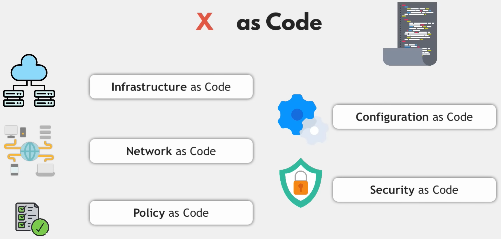

    <h1>Why Infrastructure as Code (IaC)</h1>

---

# Ways to work with cloud services

From okay to best:

1. Console UI (Clicking)

2. CLI / API (Shell, Bash)

3. SDK/CDK (Software/Cloud Development Clip) (Custom code scripts in programming languages)

4. IaC (Framework for provisioning of resources, Declarative, Prescriptive)

*Pros and cons of each?*

---

# Ways to work with cloud services - Pros and cons

| Method    | Cons                                                   | Pros                                                                                             |
|-----------|--------------------------------------------------------|--------------------------------------------------------------------------------------------------|
| Console UI| Not suitable for scaling, prone to manual errors       | Quick setup for experiments, easy access to resources for immediate management                   |
| CLI / API | Requires scripting for automation, potential for script-based errors | Flexible for both development and production environments, enables automation and integration    |
| SDK/CDK   | Need for coding skills, potential overhead for setup and maintenance | Facilitates complex deployments, integrates seamlessly with existing development workflows        |
| IaC       | Requires understanding of syntax and structure, overhead in template management | Ensures consistent environments, ideal for both development and production, supports CI/CD processes |

*The table is sorted by the least ideal option first. Why not just always choose IaC then?*

---

# Best method is...?

The further down the list we go:

* the steeper is the learning curve. 

* the time sink to get started grows larger.

---

# X as Code

    

[Source](https://youtu.be/f5EpcWp0THw?list=PLy7NrYWoggjxKDRWLqkd4Kbt84XEerHhB&t=49)

*Why do we want to configure everything as code?*

---

# Why IaC?

* Version control your infrastructure and add comments to it

* Automation

* Collaboration

* Sandboxing

* Testability

* Reproducibility (the "*works on my machine problem*")

* Recoverability

* Idempotency

---

# The disaster scenario

Imagine that your entire infrastructure is destroyed. 

It could happen because of a disgruntled employee or due to multiple types of accidents. 

As a company you should ask yourself:

- how prepared you are for the disaster scenario. 

- how long will it take you to recover?

Companies have folded because they couldn't recreate years of work in time to gain lost revenue from failing infrastructure.

IaC aims to solve that.  

