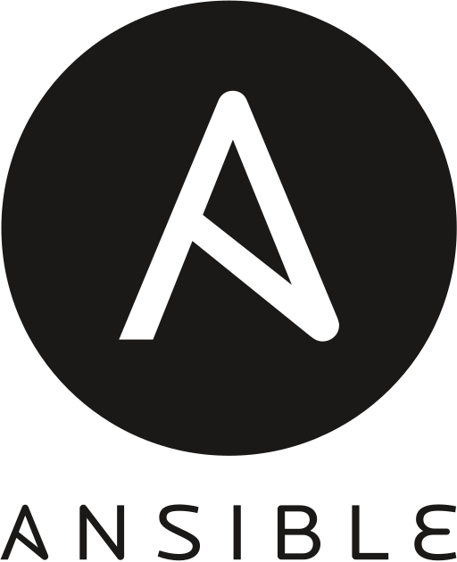

    <h1>IaC tools</h1>

---

# IaC tools - The definition of IaC

A quick note about the definition of IaC and how we use it in the course:

`1.` [**Broad Definition**] IaC: Any tool that uses code to define anything related to our infrastracture.

Example: Configuration Management Tools are also called IaC even though their focus is on what to do once the resource has been provisioned. 

`2.` [**Narrow Definition**] IaC: A specific type of tool that allows us to provision cloud resources.

---

Even though `1` is technically correct definition which encompasses `2`, from here on out, I will colloquially use IaC in the narrow sense of definition `2`.

Ansible is the exception, it can do both. 

While we are on the topic of definitions: Provisioning translates best to "Oprettelse" or "Udrulning".

---

# Top 5 Configuration Management Tools - I

<table>
  <tr>
    <td> <a href="https://www.ansible.com/">Ansible</a> Automates cloud provisioning, configuration management, and application deployments.</td>
    <td> <a href="https://www.puppet.com/">Puppet</a> Manages infrastructure as code, providing automation and deployment capabilities.</td>
    <td> <a href="https://www.chef.io/">Chef</a> Turns infrastructure into code to automate server deployment and configuration.</td>
  </tr>
  <tr>
    <td> <a href="https://saltproject.io/">Salt</a> Offers powerful automation, orchestration, and configuration management in one.</td>
    <td> <a href="https://cfengine.com/">CFEngine</a> Provides automated configuration and maintenance of large-scale IT systems.</td>
  </tr>
</table>

Ordered by most popular first.

*What do you think the benefits for configuration management tools are?*

---

# Benefits: configuration management tools

- **Automation**: Reduces manual effort and errors.

- **Time Saving**: Does not require a person to react to different outcomes.

- **Consistency**: Ensures uniform configurations across environments.

- **Scalability**: Manages large-scale infrastructure efficiently.

- **Version Control**: Track changes via versioning.

- **Security**: Enforces security policies and standards.

- **Recovery**: Aids in quick disaster recovery.

- **Collaboration**: Enhances DevOps collaboration.

---

# IaC tools - Cloud Provider Specific

## Azure

**Bicep**: A domain-specific language for declaratively deploying Azure resources.

**Azure Resource Manager (ARM) Templates**: A service provided by Microsoft Azure to deploy and manage Azure resources in a consistent manner using JSON templates.

## AWS

**AWS CloudFormation**: An AWS service that gives developers and businesses an easy way to create a collection of related AWS and third-party resources, provision and manage them in an orderly and predictable fashion.

## Google Cloud 

**Google Cloud Deployment Manager**: A service provided by Google Cloud that enables the management of cloud resources using declarative templates.

---

# IaC tools - Cloud Provider Agnostic

We are interested in a tool that isn't too proprietary and which doesn't bolt us down to a certain cloud provider. 

Very large companies use several cloud providers and a cloud provider agnostic solution would be optimal for them:

[Pulumi](https://www.pulumi.com/): Infrastructure as code in general-purpose languages like JavaScript, Python, etc.

[Serverless Framework](https://www.serverless.com/): Uses declarative YAML to define services with support for many cloud providers. 

Note: Not to be confused with serverless functions or the concept of a serverless cloud service.

[Ansible](https://www.ansible.com/): Automates cloud provisioning and config management with YAML.

[Terraform](https://www.terraform.io/): Define cloud and on-prem resources with versionable files.

We will pick Terraform for being the most widely used of all.

---

# Terraform

Maintains a dependency graph which is useful to know what order to create or destroy in. 

Keeps track through a state through the Terraform state file.

Collaborate and keep track of changes to your infrastructure in VCS. 

Declarative: Define the infrastructure you want, it manages how to achieve that.

---

# Terraform alternative

OpenTofu is an open source fork of Terraform made because of changes in their licensing.

https://opentofu.org/

Though the code for Terraform is also available:

https://github.com/hashicorp/terraform

