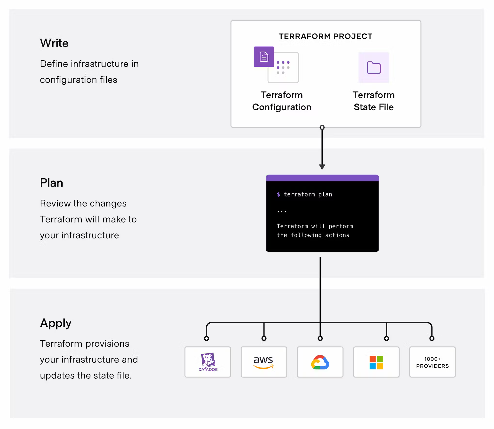
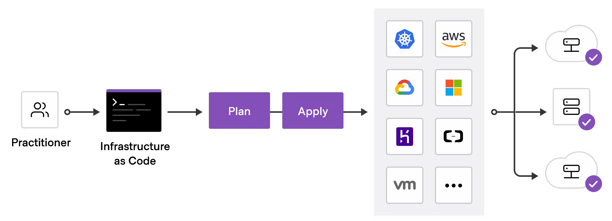

<div class="title-card">
    <h1>Terraform - Get Started</h1>
</div>

---

# Install and log in to `az`

`az` is the Azure CLI. By logging in locally Terraform can get access to our cloud.

https://developer.hashicorp.com/terraform/tutorials/azure-get-started/azure-build

```bash
$ az login
```

Verify the login:

```bash
$ az account show
```

---

# About the Azure CLI

Allows you to Interact with Azure directly through the terminal. 

You never have to use the portal again!

New Feature! Azure CLI interactive mode:

[](https://youtu.be/GqpwiyYsNIw?t=663)


---

# Clarification: Terraform under the hood

Though possible to provision everything through `az`, this is not how Terraform does it.

Terraform uses `az` to generate a user token for authorization.

This token is used to validate against what they call [Azure REST API](https://learn.microsoft.com/en-us/rest/api/azure/).

---

# Install Terraform

https://developer.hashicorp.com/terraform/install?product_intent=terraform

Success criterion: You can run the following and see the version number:

```bash
$ terraform --version
```

---

# Suggestion 1: Install auto-completion for Terraform

<span style="font-size: small;">These are suggestions you might consider to make your life easier while working with Terraform.</span>

Install terraform auto-complete (tab completion) for your terminal:

https://developer.hashicorp.com/terraform/tutorials/azure-get-started/install-cli#enable-tab-completion

---

# Suggestion 2: Alias `terraform` as `tf`

Alias the `terraform` command so that you can invoke it by simply typing `tf`.

This is pretty standard practice for Terraform users.

***nix**: 

Write `alias tf="terraform"` in the terminal and it will work in the session.

For a more permanent solution add this to your terminal's rc file (such as ~/.bashrc, ~/.zshrc).

**Windows**: Create a terminal profile if it doesn't exist, in either case open it

```powershell
$ if (!(Test-Path -Path $PROFILE)) { New-Item -ItemType File -Path $PROFILE -Force }
notepad.exe $PROFILE
```
You can now manually add this line to it and save:

```powershell
Set-Alias -Name tf -Value terraform
```

---

<div class="title-card">
    <h1>First Terraform project - Let's test it out</h1>
</div>

---

# Let's create our first Terraform project

In an empty folder run:

```bash
$ terraform init
```

It complains about a missing configuration file. Let's create `main.tf`. Then run init again.

---

# .tf files and VSCode Extensions

The `.tf` file extension is used for Terraform. In VSCode there are extensions for syntax highlighting and Intellisense. 

The official one by Hashicorp seems to be universally hated. Instead, consider the one that is higher rated.


---


<div class="title-card">
    <h1>Terraform Workflow</h1>
</div>

---

# Terraform workflow - I



Source: https://developer.hashicorp.com/terraform/tutorials/azure-get-started/infrastructure-as-code

---

# Terraform Planning

During the planning, Terraform tries to assess the current state and find out how to get to the desired state. 

It creates a dependency graph of all resources and the order that they must be created in.

*When creating a virtual machine what needs to be created and in what order?*

<details> 
  <summary>Hint</summary>
   7 resources need to be created.
</details>


---

# Virtual Machine Resource Creation and Order

1. Resource Group

2. Virtual Network

3. Subnet

4. Network Security Group

5. Public IP

6. Network Interface

7. Virtual Machine


---

# Terraform commands - overview

| Command                | Description                                          |
|------------------------|------------------------------------------------------|
| `terraform init`       | Initializes a Terraform configuration directory. Prepares your directory for other commands, installs necessary providers. |
| `terraform plan`       | Shows a preview of the actions Terraform plans to take based on the configuration files. Useful for reviewing changes before applying them. |
| `terraform apply`      | Applies the changes described by `terraform plan`. Provisions or updates infrastructure according to the Terraform configuration. |
| `terraform destroy`    | Removes all resources defined in the Terraform configuration, tearing down the managed infrastructure. |
| `terraform fmt`        | Automatically formats Terraform configuration files to a canonical format and style. |
| `terraform validate`   | Validates the syntax of the Terraform configuration files for correctness. |
| `terraform output`     | Displays the output variables defined in the configuration, useful for extracting important information like IP addresses. |
| `terraform refresh`    | Updates the local state file against real-world resources, realigning the state with the actual state of resources in the cloud. |
| `terraform import`     | Brings real-world infrastructure into Terraform management by adding it to the Terraform state file. |
| `terraform workspace`  | Manages different workspaces, allowing for managing separate states for the same configuration, useful for different environments (e.g., staging, production). |


---


# Terraform workflow - II

Let's look at the previous table again. 

*Can you spot a command and guess which stage they relate to?*



Source: https://developer.hashicorp.com/terraform/intro


---


# Terraform commands - Prepare

Run `terraform init` in an empty folder. Only need to run init once after the provider has been defined: 

```bash
$ terrraform init
```

Running validate before you apply is optional. This will tell you if your code is valid:

```bash
$ terrraform validate
```

Even more optional than validate. `fmt` will format your code and change indentation etc. to its preference. 

```bash
$ terrraform fmt
```

---

# Terraform commands - Apply

See the changes that will occur before applying them:

```bash
$ terrraform plan
```

Running apply will give you an overview once again. Type `yes` to enact them:

```bash
$ terrraform apply
```

Once finished look for this line and the numbers instead of X, Y, Z:

```
Apply complete! Resources: **X** added, **Y** changed, **Z** destroyed.
```

---

# Terraform commands - Inspect

See the changes that will occur before applying them:

```bash
$ terrraform show
```

Running apply will give you an overview once again. Type `yes` to enact them:

```bash
$ terrraform apply
```

---

# Terraform commands - Destroy

This will tear down your cloud services. 

```bash
$ terrraform destroy
```

As mentioned earlier, the smart thing about Terraform is that they take care of the dependency graph 
and will shut down services in the necessary order. 

---

# The Files of Terraform:

| File Type              | Description                                           |
|------------------------|-------------------------------------------------------|
| `*.tf` / `*.tf.json`   | Infrastructure definitions in HCL or JSON.            |
| `*.tfvars` / `*.tfvars.json` | Variable definitions for configurations.                |
| `.terraform.lock.hcl` | Tracks provider versions and dependencies.            |
| `outputs.tf`           | Defines output values from Terraform.                 |
| State Files (`terraform.tfstate`, `terraform.tfstate.backup`) | Maps configurations to real-world resources.            |


