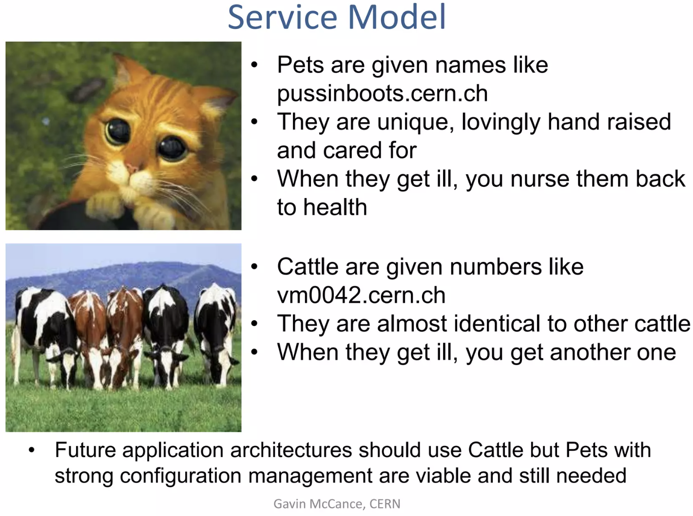
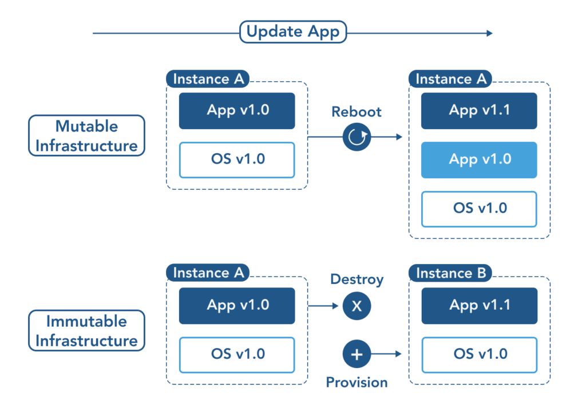

    <h1>Deploying Infrastructure and Configuration Managment</h1>

---

# Enable on-demand creation of dev, test and production environments

We talked about this last week. We can use Infrastructure as Code tools as part of our CI/CD pipeline.

Create platforms that enable developers to create their own environments by the click of a button.

---

# Make infratructure easier to rebuild than repair

> *Bill Baker, a distinguished engineer at Microsoft, quipped that we used to treat servers like pets: “You name them and when they get sick, you nurse them back to health. Now servers are treated like cattle. You number them and when they get sick, you shoot them.*

- The DevOps Handbook p. 141

[CERN agrees with Cattle rather than pets (slide 17)](https://www.slideshare.net/slideshow/cern-data-centre-evolution/15246440#9)

---

# Avoid configuration drift

> *The 2014 - 2019 State of DevOps Reports led by co-author Dr. Nicole Forsgren show that use of version control for all production artifacts was a higher predictor for software delivery performance*[...]

> *Because in almost all cases, there are orders of magnitude more configurable settings in our environment than in our code. Consequently, it is the environment that needs to be in version control the most.*

\- The DevOps Handbook page 140-141 

---

# Solution: Immutable infrastructure

Example. Wanting to update an nginx server. Two ways to do it:

[Source](https://www.opsramp.com/guides/why-kubernetes/infrastructure-as-code/)

---

# Site-Reliability Engineering (SRE)

At the big companies they have dedicated SRE (site-reliability engineering) teams that are responsible for the uptime of the systems.

