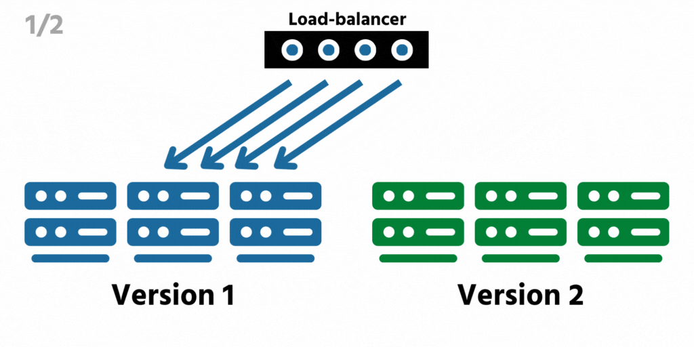
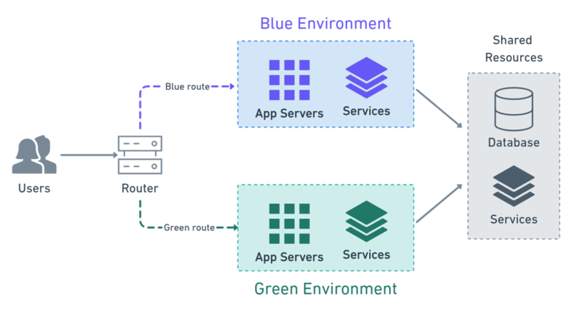
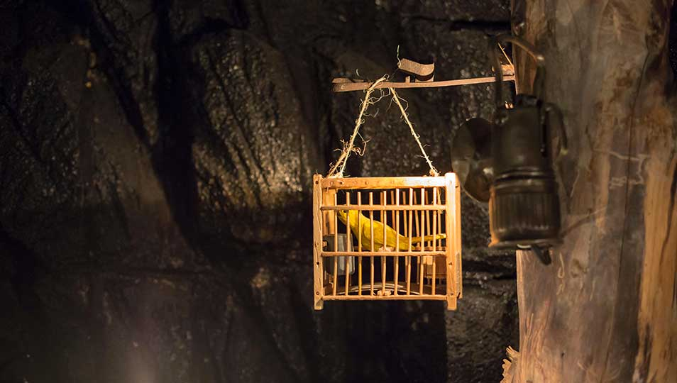
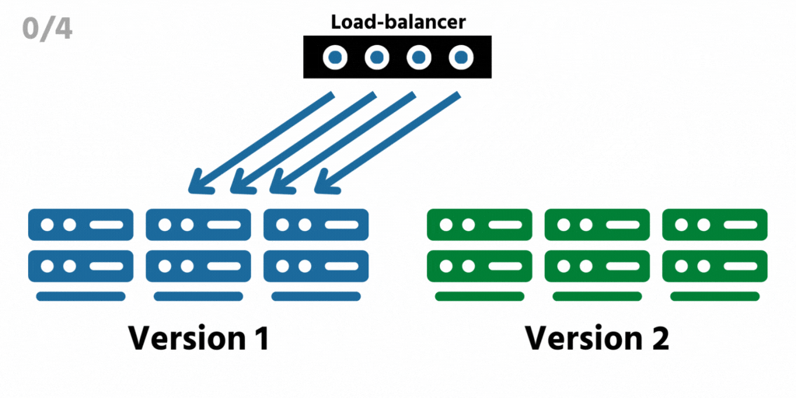
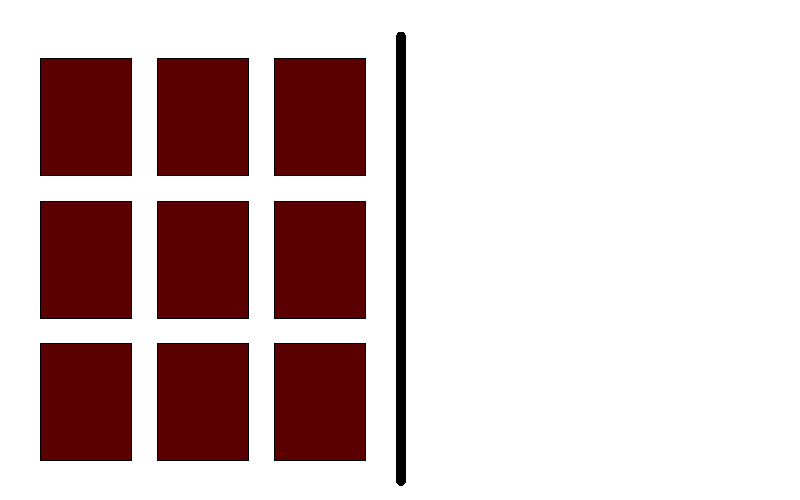
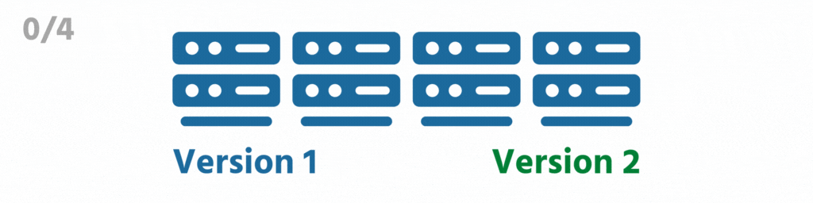
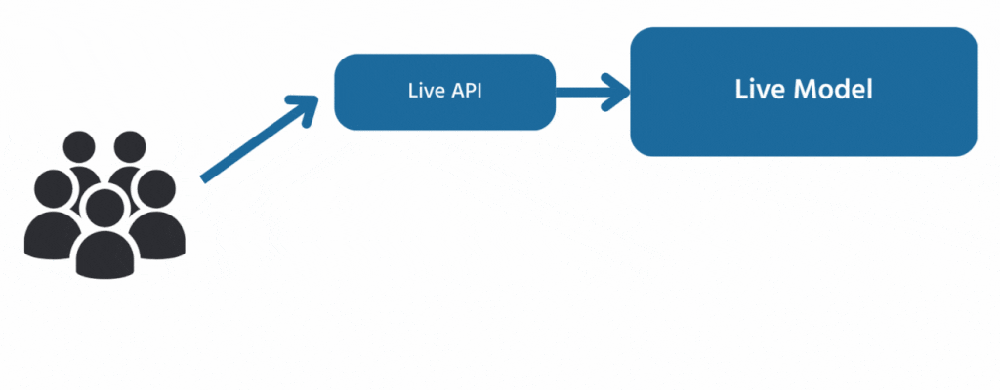

    <h1>Deployment Strategies</h1>

---

# Goal: Deploying with zero downtime

Discuss in pairs/groups.

*How would you achieve it?*

---

# Thinks to consider when deploying

*What are the considerations to make when choosing a deployment strategy?*

---

# Thinks to consider when deploying

- **Zero downtime**

- **Scalability**

- **Downtime tolerance**

- **Rollback plan**

- **Cost efficiency**

---

# Big Bang Deployment

Deploying the entire application at once.

*Why do you think it's called that?*

*What problems could occur with this approach?*

---

# Topic: Colorful deployment strategies

Images without a source in the next couple of slides are from this article:

https://devopsbootcamp.org/8-deployment-strategies-explained-and-compared/

But the material is from various sources.

---

# Blue-Green deployment

Two identical environments, where only one is "live" at any time. Let's say that blue is "live". 

In that case, use the blue environment as your staging environment.

Once all tests in staging pass, you can switch the traffic to green.

This additionally makes it much easier to roll back if something goes wrong.

---

# Blue-Green deployment and databases

There are two approaches for how to handle the database

1. **Create two databases** (a blue and a green). If we switch from blue to green, we make blue read-only, create a back-up and restore it onto green. 

2. **Decouple the database** changes from application changes: 

[Source](https://dev.to/semaphore/what-is-blue-green-deployment-1ong)

---

# Canary deployment

Gradually roll out a new version to a small subset of users before rolling it out to the entire infrastructure. 

Observe if the system is healthy, otherwise roll back.

The name comes from the old usage of canaries in coal mining to test air quality. If the canary died, it was time to get out of the mine.

  
  

---

# Cluster immune system

An expanded version of the canary deployment strategy that **automates** a rolling back mechanism. 

If health checks and monitors fail within a certain margin it will roll back. 

---

# Rolling updates

Gradual roll out of the infrastructure (instances) with the new version.

Health checks are performed and if it is healthy, more instances are flipped to the new version.

---

# Canary deployment vs. rolling updates

Canary deployment can still be considered a type of rolling update. But there are key differences. 

Unlike canary deployment which is focused on users, rolling updates are focused on infrastructure.

Canary deployment will try for a subset of users and if it is successful roll out the entire change. Rolling updates will do it in small increment. 

---

# Rolling updates vs. ramped deployment

Rolling updates deploy to one server at a time in a round-robin fashion. 

Ramped deployment deploys to an increasingly higher percentage of servers every time.

---

# Impact of update strategies on the consistency of the results that the users see

* With **blue-green** they never see inconsistent results

* With **rolling-updates** they might see different results in different calls

*Can you figure out why that is the case with rolling updates?*

---

# Shadow Deployment / Dark Launching

**Backend  Example**: Requests are duplicated and additionally sent to a shadow API in order to assess how it handles the requests.

**Frontend Example**: Facebook does a thing that they call **Feature Toggling**. For instance, they deploy invincible features that exist in the DOM but are not visible to users just to see how it holds up. Feautures can be released for months without users seeing them but they are on the production servers. 

---

# Case: How Facebook Releases 

Facebook has a dedicated *release team* and they use the internal tool - Facebook Gatekeeper - to release to specific groups. 

**Facebook Gatekeeper** can target a release to users in certain demographics / regions.

They have a 3 step release model. Release to:

- **A1 group**: production servers that only serve internal employees.

- **A2 group**: production servers that only serve a small percentage  of  customers  and  are  deployed  when certain  acceptance  criteria  have  been  met  (either automated or manual).

- **A3 group**:  the  rest  of  the  production  servers,  which are  deployed  after  the  software  running  in  the  A2 cluster meets certain acceptance criteria

---

# Other internal tools

Facebook GateKeeper has just been mentioned. 

**Etsy Feature API** and **Netflix Archaius library** are other famous examples of tools used for deployment strategies that can achieve many of the techniques mentioned so far.

