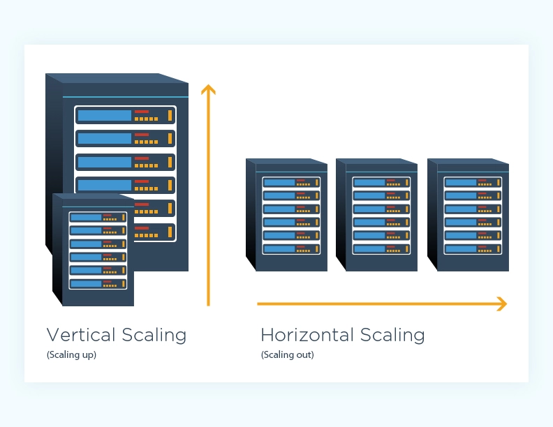
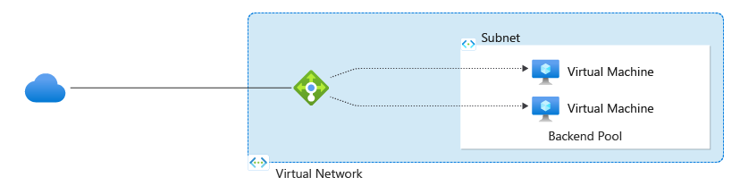

    <h1>Orchestration</h1>

---

# Fault tolerance - One solution: Redundancy

Solution to the single-point-of-failure problem. Creates resilience. 

*The human body is resilient. Give examples of redundancy.*

 
  
The human body

   The human body has two kidneys, two lungs, two eyes, two ears, and so on. If one fails, the other can take over.

---

# Scalability

Designing for scalability -> accommodate increased demand. 

- **Vertical scaling**: increase the capacity of a single server

- **Horizontal scaling**: add more servers

[Example](https://www.cloudzero.com/blog/horizontal-vs-vertical-scaling/)

---

# Congestion

A bottleneck in the system where the capacity is exceeded.

The solution: load balancing

Example: [Azure Load Balancer](https://learn.microsoft.com/en-us/azure/load-balancer/load-balancer-overview)

---

# Load Balancing and keepalive

[Source: Digital Ocean](https://www.digitalocean.com/community/tutorials/how-to-create-a-high-availability-setup-with-heartbeat-and-reserved-ips-on-ubuntu-16-04)

Another pouplar setup is [HAProxy with Keepalived](https://kifarunix.com/configure-highly-available-haproxy-with-keepalived-on-ubuntu/).

---

# Advanced orchestration platforms

- **Kubernetes**

- **Docker Swarm** *(deprecated and added as a plugin to Kubernetes instead)*

- **OpenShift**

- **Mesos**

- **Nomad**

