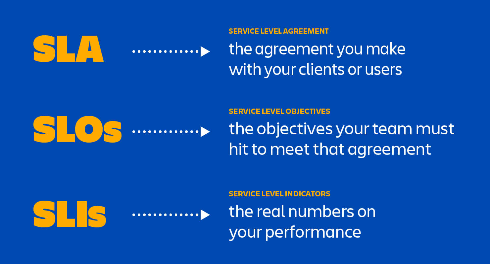
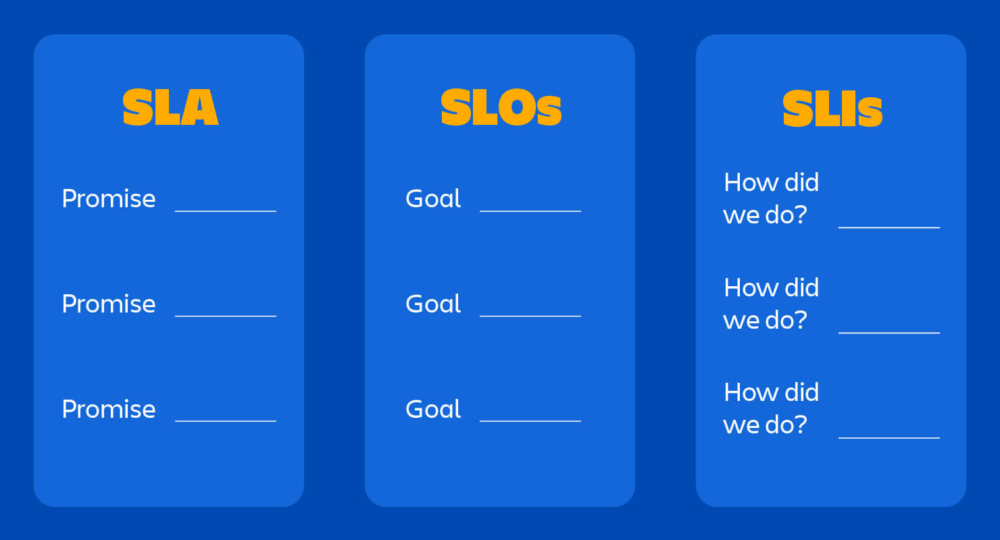
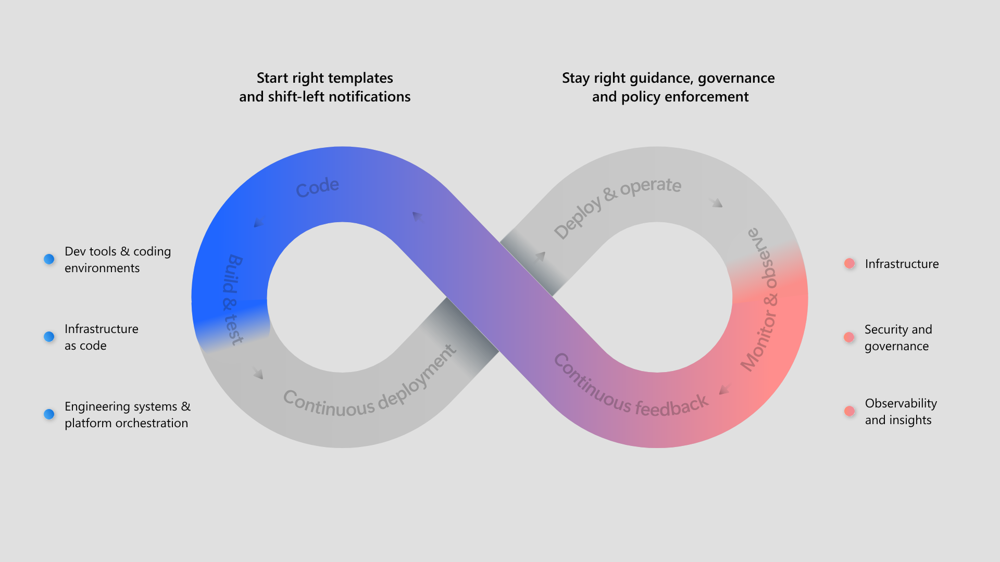

    <h1>Maintenance</h1>

---

# Maintenance: The Missing Piece in your Education

During your time at KEA, you learn how to build things from scratch. 

And you might spend time bug fixing and refactoring.

This is your opportunity to maintain a system that is already in production.

---

# What comprises Maintenance?

* fixing bugs

* keeping its systems operational

* investigating failures

* adapting it to new platforms

* modifying it for new use cases

* repaying technical debt

* adding new features

* etc.

\- [Kleppmann "Designing Data-Intensive Applications" (2017)](https://www.oreilly.com/library/view/designing-data-intensive-applications/9781491903063/ch01.html)

---

# Maintenance as viewed by the [ISO 25010](https://www.iso.org/standard/35733.html) specification

To aid maintenance, the software should be designed for:

* Modularity

* Reusability

* Analysability

* Modifiability

* Testability

*What does this slide remind you of?*

---

# Parallels to earlier in the course

Topic: Technical debt. 

---

# Design for Maintainability

> [...] minimize pain during maintenance, and thus avoid creating legacy software ourselves.

> * a) **Operability**
>  Make it easy for operations teams to keep the system running smoothly.

> * b) **Simplicity**
>  Make it easy for new engineers to understand the system, by removing as much complexity as possible from the system. (Note this is not the same as simplicity of the user interface.)

> * c) **Evolvability**
  > Make it easy for engineers to make changes to the system in the future, adapting it for unanticipated use cases as requirements change. Also known as extensibility, modifiability, or plasticity.

\- [Kleppmann "Designing Data-Intensive Applications" (2017)](https://www.oreilly.com/library/view/designing-data-intensive-applications/9781491903063/ch01.html)

---

# SLAs vs. SLOs vs. SLIs

Promises made by a service provider to a customer regarding systems in production.

  
  

[Source - Atlassian](https://www.atlassian.com/incident-management/kpis/sla-vs-slo-vs-sli).

---

# Examples of real-life SLAs

https://www.microsoft.com/licensing/docs/view/Service-Level-Agreements-SLA-for-Online-Services?lang=1&year=2023

https://cloud.google.com/terms/sla/

---

# SRE (Site Reliability Engineering)

https://sre.google/books/

---

# Platform Engineering

[Source - Microsoft: What is Platform Engineering?](https://learn.microsoft.com/en-us/platform-engineering/what-is-platform-engineering)

---

# Definition of done

Let's discuss:

*When will you know when your work on the project is over?*

There is no right answer. Each group might come up with their own definition.
